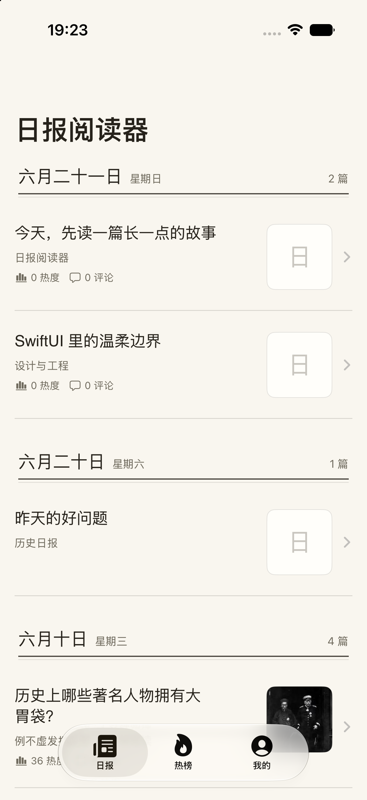
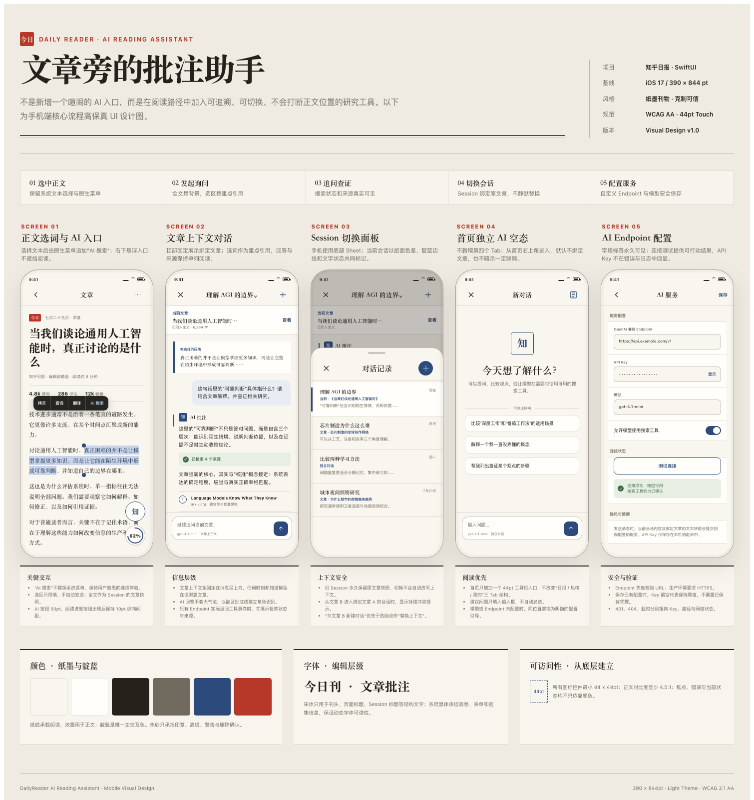

# 日报阅读器

一款使用 SwiftUI 构建的知乎日报阅读器。项目在“日报 / 热榜 / 我的”三栏阅读结构上，加入编辑化的“今日刊”视觉系统、分层网络与离线缓存、文章互动数据，以及与正文上下文联动的 AI 阅读助手。

当前版本：**2.0** ｜ 最低系统：**iOS 17.0** ｜ Swift：**5.9**

## 功能概览

### 日报阅读

- 浏览今日内容、顶部故事与历史日报。
- 使用连续 WebView 阅读完整正文，支持作者信息、互动数据、阅读进度和回到顶部。
- 统一处理文章式正文与知乎问答式正文。
- 支持收藏、已读记录、分享与“冷宫”隐藏管理。
- 网络失败时优先回退到磁盘缓存，并提供清晰的空态和重试入口。

<table>
  <tr>
    <td align="center"><br><sub>首页 · 日报数据独立信息行</sub></td>
    <td align="center"><br><sub>文章详情 · 日报与原回答互动数据</sub></td>
  </tr>
</table>

### 知乎热榜

- 浏览知乎热榜及热度信息。
- 进入问题的精选回答列表与回答详情。
- 对加载、空数据、超时和正文缺失场景提供明确反馈。

### 我的

- 集中管理收藏和已读内容。
- 支持收藏 / 已读胶囊切换与本地搜索。
- 从页面设置入口管理阅读数据、缓存和 AI 服务。

<p align="center">
  
  <br>
  <sub>阅读适配 · 深色模式与大字号</sub>
</p>

### AI 阅读助手

- 从首页打开独立对话，或从文章详情打开绑定正文上下文的会话。
- 文章空白会话提供 3 条快捷问题，点击即可立即发送：
  - 用三句话总结这篇文章
  - 解释文中的核心概念
  - 查证文章中的关键结论
- 支持选择正文片段，通过原生菜单将选段带入会话。
- 支持流式回答、停止生成、重新生成、复制、搜索状态、引用来源与外部链接。
- 支持多 Session 新建、切换、重命名、删除与本地恢复。
- 支持用户配置 OpenAI 兼容服务；API Key 保存到 Keychain。
- 内置默认服务可包含多条内部线路，请求时并发竞速，以首条有效正文选择唯一赢家并取消其余请求。

> 未配置可用 AI 服务时，阅读功能仍可正常使用。快捷问题会保留在输入框中，并引导用户前往配置。

<p align="center">
  
  <br>
  <sub>AI 阅读助手 · 会话、上下文与服务配置设计</sub>
</p>

## 技术栈

| 分类 | 方案 |
| --- | --- |
| UI | SwiftUI、UIKit / WebKit 桥接 |
| 并发 | Swift Concurrency、Actor、AsyncThrowingStream |
| 网络 | Alamofire |
| 图片 | Kingfisher |
| 架构 | Feature Presentation → Repository → Service / Transport |
| 本地存储 | UserDefaults、磁盘缓存、Keychain、本地 AI Session 文件 |
| 测试 | XCTest 单元测试与 XCUITest |
| 工程生成 | XcodeGen（`project.yml`） |

## 架构概览

```text
SwiftUI Views
    ↓
Feature ViewModels / Coordinators
    ↓
Repositories
    ↓
Services / AI Chat Services
    ↓
HTTP Transport · Disk Cache · Keychain · Session Store
```

主要边界：

- `Features/`：日报、详情、热榜、我的、设置与 AI 阅读助手。
- `Repositories/`：协调网络结果、缓存结果与业务数据。
- `Services/`：生产 API 与 UI 测试 Fixture 服务。
- `Networking/`：Endpoint、HTTP Client 和错误映射。
- `Storage/`：磁盘缓存、缓存策略与 Keychain 辅助能力。
- `Shared/`：设计系统、通用状态视图、图片和交互组件。

## 环境要求

- macOS 与 Xcode（需包含 iOS 17.0 或更高版本 SDK）
- Swift 5.9 或更高版本
- XcodeGen（仅在修改 `project.yml` 后重新生成工程时需要）

项目依赖由 Swift Package Manager 管理，首次打开工程时 Xcode 会解析 Alamofire 和 Kingfisher。

## 快速开始

### 1. 获取项目

```bash
git clone "https://github.com/pengzishang/--SwiftUI.git"
cd "--SwiftUI"
```

### 2. 打开工程

```bash
open "知乎日报-SwiftUI.xcodeproj"
```

在 Xcode 中选择 `DailyReader` Scheme 和一个 iOS 17+ 模拟器，然后运行。

### 3. 可选：重新生成工程

仅当 `project.yml` 发生变化时执行：

```bash
xcodegen generate
```

重新生成后，请检查工程差异和 Scheme，避免覆盖手工配置。

## AI 服务配置

项目无需内置 AI 凭据也可构建和使用基础阅读功能。AI 服务有两种配置方式。

### 应用内自定义服务

进入“我的”页面的设置入口，打开“AI 服务设置”，填写：

- OpenAI 兼容 Endpoint
- 模型名称
- API Key
- 是否允许搜索工具

API Key 通过 Keychain 保存，不写入普通配置文件。

### 本地内置服务

1. 复制示例文件：

```bash
cp "Config/AIProviders.local.xcconfig.example" \
   "Config/AIProviders.local.xcconfig"
```

2. 参考 `Config/AIProviders.payload.json.example` 准备服务与内部线路配置。
3. 将 JSON 编码为不带 padding 的 Base64URL 字符串。
4. 把结果写入本地配置中的 `AI_BUILTIN_PROVIDERS_B64URL`。

`Config/AIProviders.local.xcconfig` 已被 Git 忽略。**不要把真实 Endpoint、模型凭据或 API Key 提交到仓库。**

## 构建与测试

### 构建 Debug 版本

```bash
xcodebuild \
  -project "知乎日报-SwiftUI.xcodeproj" \
  -scheme "DailyReader" \
  -destination "platform=iOS Simulator,name=<你的模拟器名称>" \
  build
```

### 运行全部测试

```bash
xcodebuild \
  -project "知乎日报-SwiftUI.xcodeproj" \
  -scheme "DailyReader" \
  -destination "platform=iOS Simulator,name=<你的模拟器名称>" \
  test
```

### 运行指定测试

```bash
# 单元测试
xcodebuild \
  -project "知乎日报-SwiftUI.xcodeproj" \
  -scheme "DailyReader" \
  -destination "platform=iOS Simulator,name=<你的模拟器名称>" \
  -only-testing:DailyReaderTests/AIChatViewModelTests \
  test

# UI 测试
xcodebuild \
  -project "知乎日报-SwiftUI.xcodeproj" \
  -scheme "DailyReader" \
  -destination "platform=iOS Simulator,name=<你的模拟器名称>" \
  -only-testing:DailyReaderUITests/HomeFlowUITests \
  test
```

UI 自动化通过 `-UITestMode` 与 `MOCK_SCENARIO` 注入本地 Fixture，不依赖生产接口。具体场景和启动参数见[自动化测试基础设施](docs/testing/automation-infrastructure-v1.2.md)。

## 目录结构

```text
.
├── Config/                         # AI 内置服务构建配置与安全示例
├── DailyReader/
│   ├── Features/                   # Home / Detail / HotList / Me / AI
│   ├── Models/                     # 领域与持久化模型
│   ├── Networking/                 # Endpoint 与 HTTP Client
│   ├── Repositories/               # 数据协调层
│   ├── Services/                   # 生产服务与 Fixture 服务
│   ├── Shared/                     # 设计系统、通用 UI、图片能力
│   ├── Storage/                    # 缓存与 Keychain
│   └── Resources/                  # Info.plist、Assets、Fixture
├── DailyReaderTests/               # 单元测试
├── DailyReaderUITests/             # UI 自动化测试
├── docs/                           # 版本、设计、功能与测试文档
├── project.yml                     # XcodeGen 工程定义
└── 知乎日报-SwiftUI.xcodeproj/      # 可直接打开的 Xcode 工程
```

## 文档索引

- [文档中心](docs/README.md)
- [2.0 发布说明](docs/releases/v2.0/README.md)
- [项目设计系统](docs/design/design-system.md)
- [AI 阅读助手 UI 规格](docs/design/ai-reading-assistant/ui-design-spec.md)
- [文章互动数据设计](docs/design/article-metrics/design-spec.md)
- [自动化测试基础设施](docs/testing/automation-infrastructure-v1.2.md)

## 数据与安全说明

- 项目用于学习和产品工程实践，内容版权归原作者及相应平台所有。
- 新闻、热榜和回答能力依赖相应数据接口，接口变更可能影响部分功能。
- 不要提交真实 AI 凭据、用户隐私数据、`.xcresult` 或本地构建产物。
- 用户自定义 AI API Key 保存在系统 Keychain；内置服务凭据仅允许通过 Git 忽略的本地构建配置注入。

## 当前状态

- 发布版本：`2.0.0`
- 应用版本：`2.0 (2)`
- 主要目标：iOS 17+
- 当前开发能力包含文章 AI 快捷提问；具体变更以当前分支和 Git 历史为准。
