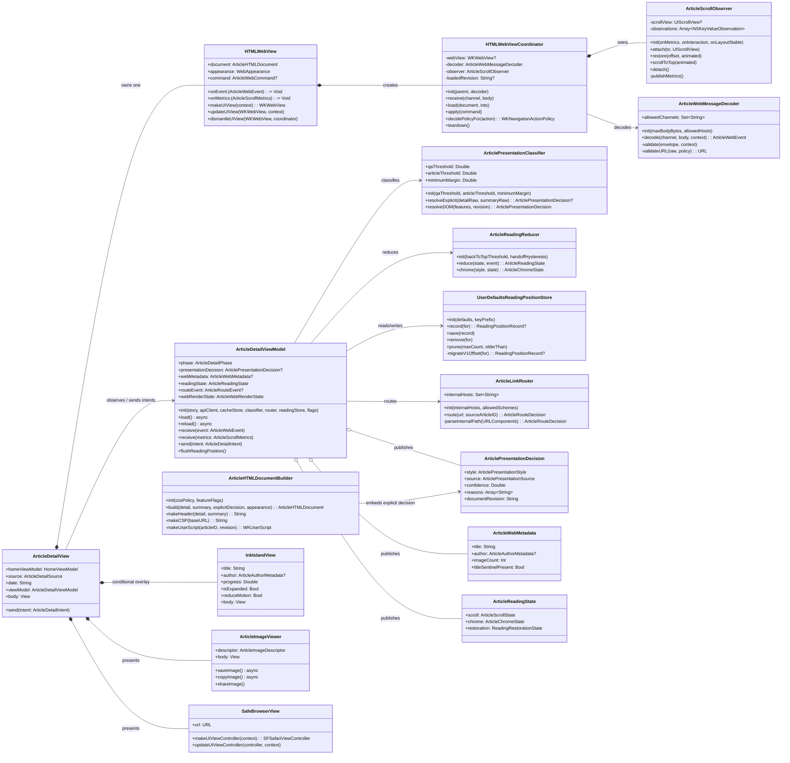
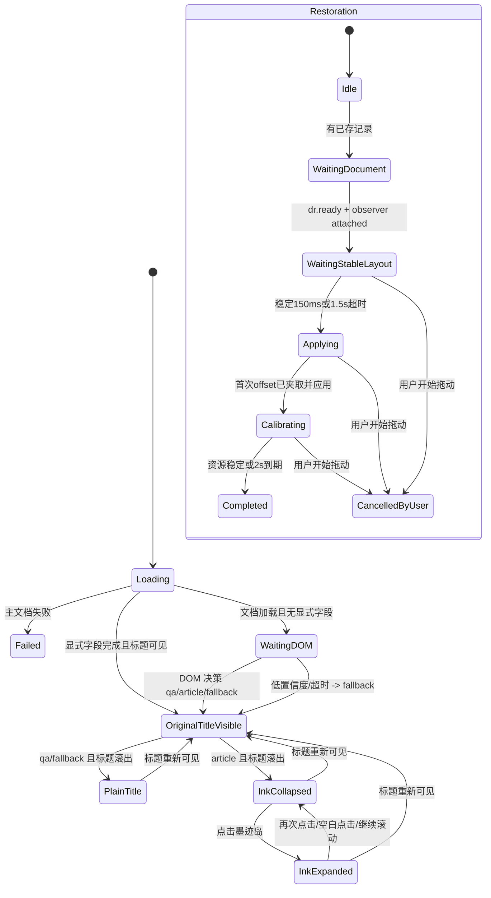
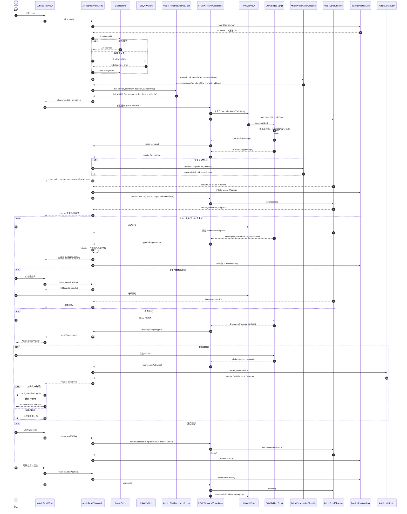
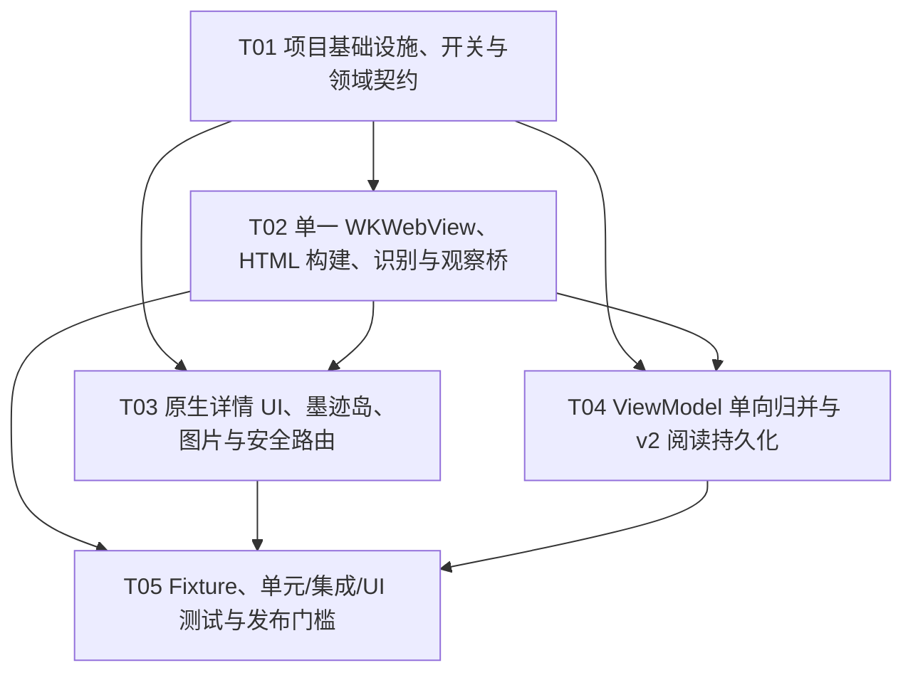

# 文章详情双正文系统增量架构设计

> 项目：知乎日报-SwiftUI
> 交付性质：增量架构文档，仅指导实现，不包含源码变更
> 上游需求：`docs/features/article-detail/dual-style-product-requirements.md`
> 适用平台：iOS 17+ / Swift 5.9 / SwiftUI / WebKit
> 架构基线：以当前工作区中的实现为准；当前工作区已有未提交变更，本方案不假定其已发布。

---

## 0. 结论摘要

本增量采用 **SwiftUI 容器 + 单一可滚动 `WKWebView` + Coordinator 适配层 + DOM 哨兵/结构化消息桥 + 原生单向状态流**：

1. 正文唯一滚动容器是 `WKWebView.scrollView`；删除外层 SwiftUI `ScrollView`、WebView 禁滚、JS 正文高度同步和 `520pt` 最小高度。
2. 展示风格固定为 `qa / article / fallback`。有效显式字段优先；字段缺失才做一次 DOM 识别；字段非法、识别异常、低置信度或超时均进入 `fallback`。一次文档生命周期内不因滚动、图片加载或尺寸变化重新切换模板。
3. Web 标题原件始终保留在 DOM 正常文档流中。若 API 的 `body` 本身没有标题，则由文档构建器在 Web 文档流顶部补入唯一标题节点；原生导航只显示同步副本，不隐藏、不透明化、不绝对定位原件，也不保留空盒。
4. `qa`、`fallback` 在标题滚出导航栏下沿后显示普通单行导航标题；`article` 显示“墨迹岛”，可展开完整标题、作者/来源及阅读百分比。
5. 阅读偏移、最大偏移、进度和返回顶部直接来自 `WKWebView.scrollView`；标题交接来自 DOM 标题哨兵。位置恢复采用“首次稳定恢复 + 延迟资源校准 + 用户接管即停止校准”。
6. Web 到原生只开放六个结构化消息 channel；图片和链接不传裸字符串。所有 payload 做版本、文章 ID、类型、长度、URL、序号和白名单校验。
7. 站内已支持路径映射为 `NavigationStack` 路由；外部 `http(s)` 使用 `SFSafariViewController`；未知 scheme、畸形 URL、站内未知路径全部拒绝并显示可理解反馈。
8. 不新增第三方依赖。复用现有 Alamofire、缓存、收藏/已读/不感兴趣、分享、WebView 预热和阅读位置能力；用运行时开关保留旧详情页回滚入口，稳定后再移除旧分支。

---

# Part A：系统设计

## 1. 现状、边界与方案取舍

### 1.1 已核对的现状

| 文件 | 当前事实 | 与目标的差距 |
| --- | --- | --- |
| `DailyReader/Features/Detail/ArticleDetailView.swift` | 外层 `ScrollView` 包裹封面、原生标题/元信息和固定高度 WebView；维护 `htmlContentHeight = 520`；嵌套图片浏览器类型；普通 `.navigationTitle`；菜单能力已存在 | 形成双层内容架构；原生重复题图/标题/作者语义；不能按 Web 标题位置交接；无 `qa/article/fallback`；Bar Item 反馈、墨迹岛和安全浏览器缺失 |
| `DailyReader/Features/Detail/HTMLWebView.swift` | `WKWebView.scrollView.isScrollEnabled = false`；单个 `imageClicked` 裸字符串消息；JS 测高并 `max(height, 520)`；点击 `http(s)` 直接 `UIApplication.shared.open`；主题/字号变化通过内容 key 重载 | 必须改为唯一滚动容器；移除测高；扩展为六 channel；主题/字号宜增量更新；链接策略不满足站内路由与安全浏览器 |
| `DailyReader/Features/Detail/ArticleScrollObserver.swift` | 作为隐藏 `UIViewRepresentable` 向上寻找外层 SwiftUI `UIScrollView` 并 KVO；恢复和返回顶部作用于外层滚动视图 | 观察对象必须改为明确注入的 `WKWebView.scrollView`，不再遍历视图层级 |
| `DailyReader/Features/Detail/ArticleDetailViewModel.swift` | 管理加载/缓存/失败、分享 URL 和标题；缓存优先后直接返回 | 缺少展示决策、Web 生命周期、桥事件、滚动/导航/恢复状态；缓存优先策略保持，不在 ViewModel 解析 DOM |
| `DailyReader/Models/ArticleDetail.swift` | 含 `id/title/body/image/images/imageSource/shareURL/url/css/js`，宽松解码 | 无显式模板字段；无作者结构；`js` 不应为正文执行面开放 |
| `DailyReader/Models/StorySummary.swift` | `id/title/images/hint/url`；标题非空强校验 | 可继续作为加载前标题和来源回退；不承担最终模板识别 |
| `DailyReader/Shared/UI/Theme.swift` | 已有纸/墨/靛蓝/朱砂动态颜色及导航外观 | 可复用色板；需补充高对比解析和共享纸面压印样式，不应引入第二套颜色常量 |
| `DailyReader/Storage/ReadingPositionStore.swift` | `UserDefaults` 按 story ID 保存 offset；250ms 防抖；退出 flush；短文最大偏移为 0 时当前进度计算为 0 | 存储协议可演进复用；短文必须改为 100%；需保存内容指纹/进度/时间以便布局变化后恢复 |
| `DailyReader/Features/Detail/ArticleWebViewPrewarmer.swift` | App 启动后预热一个透明 WKWebView | 保留预热策略；预热配置不得注册业务 handler，也不得复用预热实例承载正文 |
| `project.yml` | iOS 17、Swift 5.9；应用依赖 Alamofire；单元/UI 测试 target 已存在 | 无需新增包；新增 Swift 文件会由目录 source 自动纳入；HTML fixture 需确认作为测试资源被拷贝 |
| 现有测试 | ViewModel 覆盖加载/缓存/分享；ReadingPosition 覆盖 offset、隔离、进度、flush；UI 覆盖正文滚动、回顶、恢复、图片预览、空正文 | 缺少模板识别、桥解码、安全链接、标题交接、墨迹岛、动态字号/主题/Reduce Motion/VoiceOver 和真实 HTML fixture |

### 1.2 变更边界

**本次实现范围**：日报文章详情 `ArticleDetailView` 及其 Web 渲染、导航反馈、媒体/链接路由、位置持久化和对应测试。

**保持不变**：

- `DailyAPIClient` 的网络接口和 `DiskCacheStore` 主体协议；`ArticleDetail` 新字段使用可选宽松解码，旧缓存仍能解码。
- `HomeViewModel` 现有收藏、已读、隐藏/恢复与分享操作入口；仅在详情 View 重新组织菜单与反馈，不重写其持久化。
- 首页、热榜、我的页面对 `ArticleDetailView` 的创建方式；必要时只通过默认参数兼容，不要求调用点批量修改。
- 不实现关注、评论、账号后端、离线全文或跨设备同步。

**明确禁止**：

- 不在原生正文区域再次绘制题图、完整标题、作者或正文。
- 不通过 `display:none`、`visibility:hidden`、`opacity:0`、绝对定位移出屏幕等方式隐藏 Web 标题原件。
- 不执行 `ArticleDetail.js`、正文内联脚本或任意远端脚本。
- 不允许 Web 内容直接调用 `UIApplication.shared.open`。
- 不因 ResizeObserver、图片加载或快速滚动重复识别并切换模板。

### 1.3 核心难点与取舍

#### 难点 A：模板识别不能阻断首屏，也不能误判后反复切换

- 取舍：有效显式字段在 Swift 解码后立即定案；字段缺失时先以中性的 `fallback` CSS 构建文档，`documentEnd` 做一次 DOM 特征提取和打分，再在同一文档上设置 `data-dr-style`，不重载。
- 低置信度宁可回落。`fallback` 是正式可阅读状态，不是错误页。
- 模板决策写入 `ArticlePresentationDecision`，当前文档 revision 内只允许从 `.pending` 进入一次终态。

#### 难点 B：SwiftUI 与 WKWebView 只能有一个滚动事实源

- 取舍：`HTMLWebView` 在 loaded 状态铺满详情内容区；`WKWebView.scrollView.isScrollEnabled = true`，SwiftUI 仅叠加导航、加载/错误、回顶、墨迹岛面板、图片浏览器和 Safari sheet。
- `ArticleScrollObserver` 改为普通 KVO + `panGestureRecognizer` target 观察对象，由 Coordinator 直接 `attach(to: webView.scrollView)`；不再向上查找外层滚动视图，也不接管 `WKWebView.scrollView.delegate`，避免破坏 WebKit 内部滚动代理。

#### 难点 C：标题交接依赖 DOM 几何，而进度依赖原生滚动几何

- 取舍：进度、最大偏移、回顶阈值、持久化 offset 以原生 `WKWebView.scrollView` 为准；标题底边和标题哨兵有效性由 JS 计算，通过节流后的 viewport 消息同步。二者在 ViewModel/阅读会话中归并为 `ArticleScrollState`。
- 导航栏下沿阈值由原生传入 CSS 像素坐标 `handoffThresholdCSSPx`，默认 0 表示 Web viewport 顶边；加入 2 CSS px 回滞，避免边界闪烁。

#### 难点 D：HTML 可用性与安全性

- 取舍：不用第三方 HTML parser；由 `ArticleHTMLDocumentBuilder` 生成外壳、CSP、唯一 root、标题/作者/题图缺失补位节点。正文原字符串置于 root 中，但 CSP 禁止脚本、frame、object、connect；`WKUserScript` 在独立内容世界注入受控桥脚本。
- 导航 delegate 对所有主框架跳转二次拦截；消息桥只能请求原生路由，不能自行打开 URL。

#### 难点 E：延迟图片导致恢复二次跳动

- 取舍：存储绝对 offset + progress + 内容指纹。首次在 ready 且 contentSize 连续 150ms 稳定后恢复；2 秒校准窗口内若布局变化且用户尚未拖动，则按同指纹 offset、异指纹 progress 重新夹取一次；用户触摸后立即结束自动校准。

### 1.4 架构模式与框架

- **模式**：MVVM + Adapter/Coordinator + 明确状态机。
- **SwiftUI**：页面组合、toolbar、overlay、sheet/fullScreenCover、环境适配。
- **WebKit**：正文、DOM、滚动、受控脚本和消息桥。
- **SafariServices**：外部 `http(s)` 安全浏览器。
- **Combine/Observation**：沿用 `ObservableObject/@Published`，不在本增量强制迁移 Observation 宏。
- **Foundation/CryptoKit**：Codable 严格解码、URLComponents、SHA-256 内容指纹。
- **XCTest/XCUITest**：单元、集成和 UI fixture。
- **第三方依赖**：零新增；保留项目既有 Alamofire。

---

## 2. 精确文件清单

### 2.1 新增文件

| 相对路径 | 职责 |
| --- | --- |
| `DailyReader/Features/Detail/ArticleDetailFeatureFlags.swift` | 运行时开关 `dualStyleEnabled`，支持 Info.plist 默认值、启动参数/环境覆盖，作为分阶段回滚入口 |
| `DailyReader/Features/Detail/ArticlePresentation.swift` | `ArticlePresentationStyle`、识别来源、识别原因、元数据、决策结果、DOM 特征与分类器 |
| `DailyReader/Features/Detail/ArticleWebMessage.swift` | 六 channel 常量、共同 envelope、各 payload、严格解码器、验证错误和弱引用 handler |
| `DailyReader/Features/Detail/ArticleHTMLDocumentBuilder.swift` | 构建唯一 HTML 文档、CSP、CSS 变量、DOM 标题/作者/题图补位、桥脚本；计算 document revision/fingerprint |
| `DailyReader/Features/Detail/ArticleReadingState.swift` | 滚动状态、标题交接状态、墨迹岛状态、恢复状态、事件 reducer |
| `DailyReader/Features/Detail/InkIslandView.swift` | 墨迹岛收起态和展开面板；完整无障碍语义；AX3+ 文案降级 |
| `DailyReader/Features/Detail/PaperPressButtonStyle.swift` | 共享 44pt 无边框 Bar Item/按钮纸面压印反馈；Reduce Motion 分支 |
| `DailyReader/Features/Detail/ArticleLinkRouter.swift` | URL 校验、站内 host/path 白名单、路由决策、拒绝原因；不直接触发 UI |
| `DailyReader/Features/Detail/SafeBrowserView.swift` | `SFSafariViewController` 的 `UIViewControllerRepresentable` 包装 |
| `DailyReader/Features/Detail/ArticleImageViewer.swift` | 从详情 View 拆出图片浏览器、缩放容器、长按保存/复制/分享、alt/索引语义 |
| `DailyReaderTests/ArticlePresentationClassifierTests.swift` | 显式字段、DOM 打分、阈值、冲突和 fallback 单测 |
| `DailyReaderTests/ArticleWebMessageDecoderTests.swift` | 六 channel schema、非法 payload、URL/长度/序号校验单测 |
| `DailyReaderTests/ArticleLinkRouterTests.swift` | 站内/站外/未知 scheme/畸形 URL 白名单单测 |
| `DailyReaderTests/ArticleReadingStateTests.swift` | 标题交接、墨迹岛、进度、短文、恢复 reducer 单测 |
| `DailyReaderTests/TestFixtures/ArticleDetail/qa-explicit.html` | 显式 qa、多个问题/回答/作者/头像 fixture |
| `DailyReaderTests/TestFixtures/ArticleDetail/qa-dom.html` | 无显式字段、DOM 可判 qa fixture |
| `DailyReaderTests/TestFixtures/ArticleDetail/article-explicit.html` | 显式 article、标题/作者/可选题图 fixture |
| `DailyReaderTests/TestFixtures/ArticleDetail/article-dom.html` | 无显式字段、连续段落可判 article fixture |
| `DailyReaderTests/TestFixtures/ArticleDetail/ambiguous-fallback.html` | 冲突或低置信度 fixture |
| `DailyReaderTests/TestFixtures/ArticleDetail/media-links.html` | 多图、alt、站内/站外/恶意链接、失败头像 fixture |
| `DailyReaderUITests/ArticleDetailDualStyleUITests.swift` | 三模板、单滚动容器、标题交接、墨迹岛、恢复、链接、图片与辅助功能 UI 验证 |

### 2.2 修改文件

| 相对路径 | 精确修改 |
| --- | --- |
| `project.yml` | 不新增 package；为 App Info 增加 `ArticleDetailDualStyleEnabled: true` 默认开关；显式确认测试 fixture 作为 resources 纳入测试 target（若 XcodeGen 已自动识别，保持 sources 配置且不重复 copy） |
| `DailyReader/AppRootView.swift` | `AppEnvironment.makeDetailViewModel` 注入 feature flags、classifier/router/reading store；保留 WebView 预热 |
| `DailyReader/Models/ArticleDetail.swift` | 新增可选原始字段 `presentationStyleRaw`，CodingKey 默认为 `presentation_style`；旧缓存缺字段保持兼容；不直接解码为 enum，以区分“缺失”与“非法” |
| `DailyReader/Models/StorySummary.swift` | 可选新增 `presentationStyleRaw` 作为列表适配层提示；详情显式字段优先于 summary；旧 JSON 兼容。若后端确认只有详情字段，可不增加 summary 属性，但分类器接口仍接受两个来源 |
| `DailyReader/Features/Detail/ArticleDetailViewModel.swift` | 新增 `presentationDecision/webMetadata/readingState/routeEvent/webRenderState`；接收桥事件并 reducer；提供单向 Intent 方法；保留加载、缓存和分享 URL 逻辑 |
| `DailyReader/Features/Detail/ArticleDetailView.swift` | 删除外层 `ScrollView` 和原生封面/标题/元信息正文；以全尺寸单一 `HTMLWebView` 为主；加入等宽 toolbar、普通标题/墨迹岛、展开面板、回顶、图片和安全浏览器路由；从文件移除嵌套图片浏览器类型 |
| `DailyReader/Features/Detail/HTMLWebView.swift` | 重写为可滚动 WebView；注册/注销六 channel；由 Coordinator 持有 observer；禁止任意脚本；构建/增量更新文档；转发结构化事件；删除内容高度 Binding 和测高逻辑 |
| `DailyReader/Features/Detail/ArticleScrollObserver.swift` | 从隐藏 UIViewRepresentable 改为可测试的观察服务；直接绑定 `WKWebView.scrollView`；发布 metrics、拖动事件和内容尺寸稳定事件；实现恢复/回顶命令 |
| `DailyReader/Storage/ReadingPositionStore.swift` | 协议演进为 `ReadingPositionRecord`；兼容读取 v1 offset；短文进度返回 100%；200 条/90 天清理；250ms 节流和退出 flush 继续复用 |
| `DailyReader/Shared/UI/Theme.swift` | 增加高对比 Web/SwiftUI 颜色 token 解析辅助；不改变全局色板语义 |
| `DailyReader/Networking/LocalFixtureDailyAPIClient.swift` | 增加 `detail_qa_explicit/detail_qa_dom/detail_article_explicit/detail_article_dom/detail_fallback/detail_links` UI 场景，返回可预测 HTML 和显式字段 |
| `DailyReaderTests/ArticleDetailViewModelTests.swift` | 增加展示决策锁定、桥事件归并、非法字段 fallback、路由事件和错误恢复测试；保留现有分享/缓存用例 |
| `DailyReaderTests/ReadingPositionStoreTests.swift` | 增加 v1 迁移、短文 100%、clamp、指纹变化、清理、用户接管停止校准测试 |
| `DailyReaderUITests/HomeFlowUITests.swift` | 保留现有阅读闭环用例；移除依赖旧原生标题层级/外层 ScrollView 的断言，必要时迁移到新专用 UI 测试类 |

### 2.3 删除文件

- **无物理文件删除。**
- `ArticleDetailView.swift` 内部的 `IdentifiableImageURL`、`ZoomableScrollView`、`FullScreenImageViewer` 迁移到 `ArticleImageViewer.swift`，旧定义删除，能力不删除。

### 2.4 旧属性/机制替换表

| 旧项 | 处置 | 新项 |
| --- | --- | --- |
| `@State htmlContentHeight: CGFloat = 520` | 删除 | WebView 使用父容器完整尺寸，自身滚动 |
| `HTMLWebView.contentHeight` Binding | 删除 | `WKWebView.scrollView.contentSize` 由 `ArticleScrollObserver` 观察 |
| `Coordinator.updateHeight()` / JS `scrollHeight` | 删除 | 不再同步 SwiftUI frame 高度 |
| `.frame(minHeight: htmlContentHeight)` | 删除 | `.frame(maxWidth: .infinity, maxHeight: .infinity)` |
| `webView.scrollView.isScrollEnabled = false` | 改为 `true` | WebView 成为正文唯一手势响应区域 |
| 外层 `ScrollView` | 删除 | 根视图用 `ZStack`/`GeometryReader` + WebView |
| 原生 `detailImageURL/detailTitle/metaLine` 正文块 | 删除 | 文档构建器保证 Web DOM 中唯一 header，原生仅 toolbar 副本 |
| `.navigationTitle(viewModel.shareTitle)` | 替换 | `.toolbar(.principal)` 根据状态显示空/普通标题/墨迹岛 |
| `ArticleScrollObserver` 向上查找 enclosing scroll | 删除 | `attach(to: webView.scrollView)` 显式绑定 |
| `imageClicked: String` | 删除 | `dr.image` 结构化 payload |
| `UIApplication.shared.open(url)` | 删除 | `ArticleLinkRouter` -> 站内 route / `SafeBrowserView` / reject |
| font/color 变化触发整页 reload | 降级为仅文档 revision 变化重载 | `applyAppearance(_:)` 更新 CSS 变量并触发一次 layout report |
| `htmlReloadToken` | 改名并收窄 | `documentRevision/retryGeneration`，仅正文、CSS、baseURL 或显式重试变化时 reload |
| `isWebViewLoading` 多布尔状态 | 替换 | `ArticleWebRenderState.loading/ready/failed` |

---

## 3. Swift 类型、数据结构与接口

### 3.1 领域类型

```swift
enum ArticlePresentationStyle: String, Codable, Sendable {
    case qa
    case article
    case fallback
}

enum ArticlePresentationSource: Equatable, Sendable {
    case explicit(field: String)       // presentation_style
    case dom
    case fallback(FallbackReason)
}

enum FallbackReason: String, Codable, Sendable {
    case explicitValueInvalid
    case domLowConfidence
    case domConflict
    case domUnavailable
    case detectionTimedOut
    case bridgeValidationFailed
    case missingTitle
}

struct ArticlePresentationDecision: Equatable, Sendable {
    let style: ArticlePresentationStyle
    let source: ArticlePresentationSource
    let confidence: Double             // 0...1
    let reasons: [String]              // 仅规则代码，不含正文内容
    let documentRevision: String
}

struct ArticleAuthorMetadata: Equatable, Sendable {
    let name: String?
    let source: String?
    let avatarURL: URL?
    let avatarState: ResourceLoadState
}

struct ArticleWebMetadata: Equatable, Sendable {
    let title: String
    let author: ArticleAuthorMetadata?
    let imageCount: Int
    let titleSentinelPresent: Bool
    let documentRevision: String
}

enum ResourceLoadState: String, Codable, Sendable {
    case unknown, loading, loaded, failed
}
```

### 3.2 Web 消息事件

```swift
enum ArticleWebEvent: Equatable, Sendable {
    case ready(WebReadyPayload)
    case metadata(WebMetadataPayload)
    case viewport(WebViewportPayload)
    case imageTapped(WebImagePayload)
    case linkActivated(WebLinkPayload)
    case resourceChanged(WebResourcePayload)
}

struct WebMessageEnvelope<Payload: Decodable>: Decodable {
    let version: Int                    // 仅接受 1
    let articleID: String               // String，避免 JS Number 精度问题
    let documentRevision: String        // 64 位十六进制摘要或 UUID
    let sequence: UInt64                // 同 channel 单调递增
    let timestampMS: UInt64             // performance/time origin，仅诊断
    let payload: Payload
}
```

### 3.3 滚动、恢复与路由状态

```swift
struct ArticleScrollState: Equatable, Sendable {
    var offset: CGFloat                 // >= 0
    var maximumOffset: CGFloat          // >= 0
    var progress: Double                // 0...1；不可滚动为 1
    var titleBottomCSSPx: CGFloat?
    var isOriginalTitleVisible: Bool
    var isUserInteracting: Bool
    var layoutRevision: UInt64
    var shouldShowBackToTop: Bool
}

enum ArticleChromeState: Equatable, Sendable {
    case loading
    case originalTitleVisible
    case plainTitle                      // qa/fallback 标题已滚出
    case inkIslandCollapsed              // article 标题已滚出
    case inkIslandExpanded
    case failed
}

enum ReadingRestorationState: Equatable, Sendable {
    case idle
    case waitingForDocument
    case waitingForStableLayout(deadline: Date)
    case applying(target: CGFloat)
    case calibrating(deadline: Date)
    case completed
    case cancelledByUser
}

struct ReadingPositionRecord: Codable, Equatable, Sendable {
    let storyID: Int
    let offset: Double
    let progress: Double
    let documentFingerprint: String?
    let updatedAt: Date
    let schemaVersion: Int               // 当前 2
}

enum ArticleRouteEvent: Identifiable, Equatable, Sendable {
    case story(id: Int)
    case question(id: Int)
    case answer(questionID: Int, answerID: Int)
    case safeBrowser(URL)
    case rejected(LinkRejectionReason)
    case image(ArticleImageDescriptor)
}

struct ArticleImageDescriptor: Identifiable, Equatable, Sendable {
    let id: String                       // documentRevision + index + URL hash
    let index: Int
    let url: URL
    let alt: String
    let totalCount: Int
}
```

### 3.4 核心接口

```swift
protocol ArticlePresentationClassifying {
    func resolveExplicit(detailRaw: String?, summaryRaw: String?) -> ArticlePresentationDecision?
    func resolveDOM(features: ArticleDOMFeatures, revision: String) -> ArticlePresentationDecision
}

protocol ArticleWebMessageDecoding {
    func decode(channel: String, body: Any, context: WebMessageContext) throws -> ArticleWebEvent
}

protocol ReadingPositionPersisting {
    func record(for storyID: Int) -> ReadingPositionRecord?
    func save(_ record: ReadingPositionRecord)
    func remove(for storyID: Int)
    func prune(maxCount: Int, olderThan: Date)
}

protocol ArticleLinkRouting {
    func route(url: URL, sourceArticleID: Int) -> ArticleRouteDecision
}

enum ArticleWebCommand: Equatable {
    case applyAppearance(WebAppearance)
    case requestSnapshot(reason: SnapshotReason)
    case restore(offset: CGFloat, animated: Bool)
    case scrollToTop(animated: Bool)
}
```

### 3.5 类图



---

## 4. WKWebView 生命周期与 SwiftUI 单向状态流

### 4.1 生命周期

1. `ArticleDetailView.init` 创建 `ArticleDetailViewModel` 和当前 story 的 reading session/state。
2. `load()` 先按现有策略读取缓存；命中则立即进入 loaded，不启动重复网络请求；未命中才拉取网络。
3. ViewModel 校验显式模板原始字段：
   - 有且合法：生成终态 decision；
   - 有但非法：直接 `fallback(.explicitValueInvalid)`；
   - 完全缺失：保持 `.pendingDOM`。
4. `ArticleHTMLDocumentBuilder` 生成 `ArticleHTMLDocument`：正文 root、必要的 DOM header、CSP、CSS、独立世界桥脚本、baseURL、revision。
5. SwiftUI 创建 `HTMLWebView`；`makeUIView` 只执行一次配置：数据存储、message handler、navigation delegate、滚动行为、observer。
6. `updateUIView` 仅当 `document.revision` 或 `retryGeneration` 变化时 `loadHTMLString`；颜色、字号、高对比变化调用 `applyAppearance`，不得重载正文或丢失 offset。
7. `documentEnd` 脚本查找/标记标题原件、收集 DOM 特征、图片、作者、链接并发送 `dr.ready`、`dr.metadata`；若待 DOM 识别，metadata 携带 features。
8. ViewModel 在首次合法 metadata 上锁定 presentation decision；随后只接受同 articleID + revision 的消息。
9. Coordinator 将 `WKWebView.scrollView` 交给 `ArticleScrollObserver`；原生 metrics 与 JS 标题几何合并为 reading state。
10. `dismantleUIView` 注销六个 handler、停止 KVO、取消 pending throttle/restore task、清空 delegate，防止 `WKUserContentController` 强引用泄漏。

### 4.2 单向数据流

```text
用户/系统事件
  -> ArticleDetailIntent
  -> ArticleDetailViewModel / ArticleReadingReducer
  -> @Published immutable-ish state
  -> SwiftUI 渲染 toolbar/overlay/sheet
  -> 必要时发 ArticleWebCommand
  -> Coordinator 操作 WKWebView
  -> 原生 metrics 或经校验 ArticleWebEvent
  -> ViewModel reducer
```

**禁止反向绑定**：`HTMLWebView` 不直接持有 ViewModel；Coordinator 不直接修改 SwiftUI `@State`；所有回调先成为 typed event/metrics，再由 ViewModel 归并。

### 4.3 文档和外观 key

```swift
struct ArticleHTMLDocument: Equatable {
    let articleID: Int
    let revision: String          // body/css/baseURL/header inputs 的 SHA-256
    let html: String
    let baseURL: URL?
    let initialDecision: ArticlePresentationDecision?
}

struct WebAppearance: Equatable {
    let colorScheme: ColorScheme
    let contrast: AccessibilityContrast
    let scaledBodySize: CGFloat
    let contentWidth: CGFloat
    let reduceMotion: Bool
}
```

- revision 不包含 offset、进度、墨迹岛展开状态和普通外观变化。
- 同 revision 调用 `updateUIView` 不得 `loadHTMLString`。
- 新正文或显式重试产生新 revision/generation，旧消息立刻失效。

---

## 5. 六个消息 channel：schema、校验、白名单与节流

### 5.1 共同 envelope

所有 channel 的 `message.body` 必须是可 JSON 序列化 dictionary：

```json
{
  "version": 1,
  "articleID": "1001",
  "documentRevision": "7a2f...",
  "sequence": 12,
  "timestampMS": 834.2,
  "payload": {}
}
```

共同校验顺序：

1. channel 名在固定六项集合内；其他 handler 根本不注册。
2. body 能通过 `JSONSerialization.isValidJSONObject`，序列化后不超过 32 KiB；resource/viewport 建议不超过 8 KiB。
3. `version == 1`。
4. `articleID` 仅允许十进制 1～20 位，解析后等于当前 story ID。
5. `documentRevision` 与当前加载文档完全一致，长度 16～64，只含 `[A-Fa-f0-9-]`。
6. `sequence` 在各 channel 内严格大于上次接受值；新 revision 清零序号表。
7. 字符串去首尾空白并执行上限；不得将被截断内容当作有效 URL。
8. URL 用 `URLComponents` 重新解析；禁止用户名/密码、空 host、控制字符和 Unicode 混淆后不一致 host。
9. 解码/校验失败只记录规则码和 article ID，不记录正文、标题全文、URL query；累计 5 次失败后忽略该 revision 后续非 ready 消息，但正文继续阅读并退至 fallback。

### 5.2 Channel 1：`dr.ready`

**方向**：Web -> Native；每 revision 仅一次。  
**用途**：文档可交互、哨兵和桥安装完成，启动识别/恢复。

```json
{
  "payload": {
    "readyState": "interactive",
    "titleSentinelPresent": true,
    "imageCount": 3,
    "documentHeight": 2840.5,
    "viewportHeight": 724.0,
    "layoutRevision": 1
  }
}
```

校验：`readyState` 仅 `interactive|complete`；数量 0...500；尺寸有限且 0...10,000,000；缺标题哨兵不报 Web 错误，decision 进入 fallback，并禁用标题导航副本。

节流：不节流，但同 revision 只接受首条；后续重复丢弃。

### 5.3 Channel 2：`dr.metadata`

**方向**：Web -> Native；首条必发，DOM 结构或 author 变化时至多补发一次。  
**用途**：标题副本、作者、头像、识别特征。

```json
{
  "payload": {
    "title": "完整文章标题",
    "author": {
      "name": "作者名",
      "source": "知乎日报",
      "avatarURL": "https://pic.example.com/a.jpg"
    },
    "features": {
      "questionCount": 2,
      "answerCount": 4,
      "authorAnswerPairCount": 4,
      "repeatedQuestionAnswerGroupCount": 2,
      "paragraphCount": 12,
      "textLengthBucket": "long",
      "hasPrimaryTitle": true,
      "hasSingleAuthorHeader": false
    }
  }
}
```

校验：title 0...300 字符，name/source 各 0...80；不接收 HTML；avatar 仅 `https`，host 非空，最长 2048；计数 0...500；`textLengthBucket` 仅 `empty|short|medium|long`，不传正文文本和准确字数。

白名单：作者头像 host 默认允许详情正文图片 host、`pic*.zhimg.com`、`*.zhihu.com`；host 匹配必须按完整 label/后缀边界，禁止简单 `contains`。

节流：同一 author/title/features 哈希重复丢弃；一 revision 最多 2 条。

### 5.4 Channel 3：`dr.viewport`

**方向**：Web -> Native；滚动/ResizeObserver 后。  
**用途**：标题哨兵位置、标题交接和布局 revision。阅读进度仍以原生 scrollView metrics 为准。

```json
{
  "payload": {
    "offsetY": 612.0,
    "viewportHeight": 724.0,
    "documentHeight": 2840.5,
    "titleTop": -128.0,
    "titleBottom": -4.0,
    "titleVisible": false,
    "layoutRevision": 4,
    "cause": "scroll"
  }
}
```

校验：有限数；offset 可因 rubber-band 短暂为负但解码后 clamp 为 0；height 0...10,000,000；`cause` 仅 `initial|scroll|resize|resource|appearance`。`titleVisible` 仅作诊断，最终用 `titleBottom > handoffThreshold + hysteresis` 计算，防止 JS/Native 定义分叉。

节流：JS 使用 `requestAnimationFrame` 合并，并限制 **最多 20Hz（50ms）**；Native 再按 sequence 去重。滚动停止后必须发送 trailing 最新值。Resize/resource 不受 50ms 丢弃，但同一帧合并。

### 5.5 Channel 4：`dr.image`

**方向**：Web -> Native；用户点击非头像正文图片。  
**用途**：打开原生全屏图片浏览器。

```json
{
  "payload": {
    "index": 2,
    "totalCount": 5,
    "src": "https://pic.example.com/2.jpg",
    "currentSrc": "https://cdn.example.com/2@2x.jpg",
    "alt": "图表说明",
    "naturalWidth": 1600,
    "naturalHeight": 900
  }
}
```

校验：index 0..<totalCount，total 1...500；优先 currentSrc；仅 `https` 和受控 `data:image/(png|jpeg|gif|webp);base64`，data URL 最大 5 MiB；alt 最长 300；尺寸 0...100,000。头像节点、失败资源、CSS background image 不生成此消息。

白名单：HTTPS 图片允许当前详情/正文 CSS 派生的已观察 host、知乎图片域；新 host 仍可浏览，但需通过 ATS，且不携带 cookie/header。`file/blob/javascript` 拒绝。

节流：用户事件不做时间节流；同 index 300ms 内重复点击去重，避免双 present。

### 5.6 Channel 5：`dr.link`

**方向**：Web -> Native；捕获 anchor click 后 `preventDefault()`。  
**用途**：站内路由、安全浏览器或拒绝反馈。

```json
{
  "payload": {
    "href": "https://daily.zhihu.com/story/123",
    "resolvedURL": "https://daily.zhihu.com/story/123",
    "text": "阅读相关日报",
    "target": "_blank",
    "rel": "nofollow"
  }
}
```

校验：优先 resolvedURL，最大 4096；text 最大 200 且仅用于可访问性/诊断；target 只接受空、`_self`、`_blank`；URL 必须无 credential。所有 scheme 都先交 `ArticleLinkRouter`，不得先调用系统 API。

路由白名单：

- 内部 host：`daily.zhihu.com`、`www.zhihu.com`、`zhihu.com`（配置常量，可测试）。
- 内部路径：`/story/{positiveInt}`、`/question/{positiveInt}`、`/question/{positiveInt}/answer/{positiveInt}`。
- 内部 host 上的未知路径 **拒绝**，不降级为外部浏览器，避免白名单绕过。
- 其他 host 的 `http/https` -> `.safeBrowser`；`http` 可交 Safari，但应用不主动降级 HTTPS。
- `javascript/data/file/blob/ftp/tel/mailto` 及自定义 scheme -> `.rejected(.schemeNotAllowed)`。本增量默认连 `tel/mailto` 也拒绝，后续产品明确后另开白名单。

节流：同一 resolvedURL 500ms 内去重；路由正在 present/push 时忽略重复事件。

### 5.7 Channel 6：`dr.resource`

**方向**：Web -> Native；图片/头像 load/error、字体/布局显著变化。  
**用途**：头像条件渲染、图片失败语义、恢复校准。

```json
{
  "payload": {
    "kind": "image",
    "index": 2,
    "url": "https://pic.example.com/2.jpg",
    "state": "loaded",
    "naturalWidth": 1600,
    "naturalHeight": 900,
    "layoutRevision": 5
  }
}
```

校验：kind 仅 `image|avatar|font|layout`；state 仅 `loading|loaded|failed`；index 对 font/layout 可为 null，其余必须有效；URL 规则同图片；layoutRevision 单调不减。

节流：每资源只发送状态边沿；layout 事件 100ms debounce；全 revision 最多 600 条，超过后只保留聚合 layout 事件。resource 仅触发几何校准，不重新分类模板。

### 5.8 Web 安全配置

- `WKWebsiteDataStore.nonPersistent()` 为默认；若现有登录态并非详情需求，不共享 cookie。
- `javaScriptCanOpenWindowsAutomatically = false`。
- 不加载 `ArticleDetail.js`；CSP：`default-src 'none'; script-src 'none'; connect-src 'none'; frame-src 'none'; object-src 'none'; base-uri 'none'; form-action 'none'; img-src https: data:; media-src https:; style-src 'unsafe-inline' https:; font-src https: data:`。
- 受控桥脚本使用 `WKUserScript` 注入；优先 `WKContentWorld.world(name: "DailyReader.ArticleBridge")`。若隔离世界无法访问 page DOM/handler，则桥分为“隔离世界 DOM 读取 + 固定 handler 发送”，仍不得把任意函数暴露给 page。
- navigation delegate 对 `.linkActivated`、重定向、新窗口请求和主框架 navigation 全量拦截；仅 initial `about:blank`/`loadHTMLString` 导航允许。
- 在 `dismantleUIView` 中对六个名称逐一 `removeScriptMessageHandler`。

---

## 6. 模板识别算法、阈值与 fallback

### 6.1 显式字段规则

字段优先级：

1. `ArticleDetail.presentationStyleRaw`
2. `StorySummary.presentationStyleRaw`
3. DOM 检测（仅前两者都缺失）

合法值在 trim + lowercase 后仅接受：`qa`、`article`、`fallback`。不接受数字、空字符串、同义词或部分匹配。

- 合法值：`source = .explicit(field: ...)`，`confidence = 1.0`。
- 字段存在但非法/空：`style = .fallback`、`source = .fallback(.explicitValueInvalid)`；**不继续 DOM 猜测**。
- 字段缺失：进入 DOM 检测。

默认服务字段名为 `presentation_style`。若服务端最终命名不同，只扩展 `CodingKeys` 的 alias，不改领域 enum 和识别算法。

### 6.2 DOM 特征提取

脚本先去重嵌套匹配（同一语义节点只计最外层或具有 ID 的节点），选择器集合版本化为 `detector-v1`：

- 问题节点：`[data-question-id]`, `[itemtype*='Question']`, `.question`, `.question-title`, `.question_header`。
- 回答节点：`[data-answer-id]`, `[itemtype*='Answer']`, `.answer`, `.answer-item`, `.content.answer-content`。
- 作者节点：回答节点内的 `[rel='author']`, `.author`, `.author-name`, `[itemprop='author']`。
- 主标题：构建器标记的 `[data-dr-primary-title='true']` 优先；否则 `article h1`, `.headline-title`, `.question-title`, `h1` 中首个可见且非空节点，并原位增加标记。
- 连续正文段落：root 内可见 `<p>`，排除 nav/footer/caption/blockquote 内纯引用和长度小于 2 的空段。
- 重复问答组：同一语义 section 中 question 后存在 answer，或连续 section 各自包含 question/answer。
- 不传正文文本；只传计数和长度桶：empty=0、short=1...399、medium=400...1199、long>=1200。

### 6.3 评分

先计算 0...1 分数：

```text
qaScore =
  0.30 * min(questionCount, 2) / 2
+ 0.25 * min(answerCount, 3) / 3
+ 0.25 * min(repeatedQAGroupCount, 2) / 2
+ 0.20 * min(authorAnswerPairCount, 3) / 3

articleScore =
  0.25 * hasPrimaryTitle
+ 0.30 * min(paragraphCount, 6) / 6
+ 0.20 * textLengthWeight           // empty 0, short .25, medium .70, long 1
+ 0.15 * hasSingleAuthorHeader
+ 0.10 * noStrongQAStructure
```

硬门槛：

- `qaEligible`：`questionCount >= 2`，或 `answerCount >= 2 && authorAnswerPairCount >= 2`，或 `repeatedQAGroupCount >= 2`。
- `articleEligible`：存在主标题、`paragraphCount >= 3`，且不满足 `qaEligible`。

决策：

```text
若 qaEligible 且 qaScore >= 0.72 且 qaScore - articleScore >= 0.18 -> qa
否则若 articleEligible 且 articleScore >= 0.68 且 articleScore - qaScore >= 0.18 -> article
否则 -> fallback
```

- 同时越过阈值但 margin 不足：`fallback(.domConflict)`。
- 未越过阈值：`fallback(.domLowConfidence)`。
- 脚本异常/没有 features：`fallback(.domUnavailable)`。
- `dr.ready` 后 1.5 秒仍无合法 metadata：`fallback(.detectionTimedOut)`，正文不重载。
- 阈值作为 classifier 初始化参数，仅测试/灰度配置可变；发布版本禁止服务端任意下发 JS 或选择器。

### 6.4 标题与作者元数据

- 标题原件选择后只添加 `data-dr-primary-title` 和语义属性，不改变 display/position/visibility/height。
- body 无标题时，构建器使用 `detail.title`，次选 `story.title`，在 root 首部生成 `<header data-dr-generated-header>` 和 `<h1 data-dr-primary-title>`；这是 Web 文档中唯一正文标题，不在原生正文重复。
- 作者名优先 DOM，次选 `detail.imageSource` 作为来源，最后 `story.hint`；没有作者名和来源则整个作者行为空。
- 头像只有 HTTPS URL 且 load 成功才在原生展开面板显示；加载中不预留固定槽；失败时若有作者名可显示首个用户可感知字符的文本头像，默认实现为 **仅 Web 作者卡允许首字回退，墨迹岛展开面板不显示头像槽**，避免两个层级语义不一致。

---

## 7. 标题交接、墨迹岛、进度与恢复状态机

### 7.1 标题交接判定

定义：

```text
isOriginalTitleVisible = titleBottomCSSPx > handoffThresholdCSSPx + hysteresis
isOriginalTitleOut     = titleBottomCSSPx <= handoffThresholdCSSPx - hysteresis
hysteresis = 2 CSS px
```

处于中间带时保持前一状态。title sentinel 缺失或标题为空时导航中央保持空，article 不显示无意义墨迹岛。

样式映射：

| presentation | 原标题可见 | 原标题滚出 |
| --- | --- | --- |
| `qa` | 中央空 | `.plainTitle` |
| `article` | 中央空 | `.inkIslandCollapsed` |
| `fallback` | 中央空 | `.plainTitle` |

### 7.2 墨迹岛行为

- 收起态：单行标题、左侧朱砂竖向进度；最大宽度为 principal 可用宽，左右 44pt 固定槽等宽。
- AX3+：视觉文本允许显示“文章标题”，`accessibilityLabel` 仍为完整标题，value 为“已阅读 N%”。
- 点击收起态 -> `.inkIslandExpanded`。
- 再次点击、正文任何有效滚动（offset 变化 > 1pt）、点面板外空白、标题重新可见、路由/present 或页面消失 -> collapsed/hidden。
- 展开面板位于导航栏下方 SwiftUI 内容 overlay，不加入 Web 文档，不改变 Web contentSize。
- 标准动效：进入约 220ms、退出 165ms；Reduce Motion 时只做颜色/opacity 的即时或 100ms 以内交替，无 scale/offset。

### 7.3 阅读进度

```text
maximumOffset = max(0,
  contentSize.height + adjustedInset.top + adjustedInset.bottom - bounds.height)
offset = clamp(contentOffset.y + adjustedInset.top, 0, maximumOffset)
progress = maximumOffset <= 0 ? 1 : clamp(offset / maximumOffset, 0, 1)
percentage = round(progress * 100)
```

- 原生 UI 一律用上述 progress；JS `documentHeight` 只用于一致性诊断和恢复稳定判断。
- 回顶按钮：`maximumOffset > 0 && offset > 240`；qa 可显示百分比，article 也保留共享回顶入口，但不得与 principal 争抢空间。
- 回顶后立即发布 offset=0 并安排保存；最终 article 朱砂进度为起点，qa/fallback 普通标题逻辑由 title sentinel 决定。
- Reduce Motion：`setContentOffset(..., animated: false)`；标准模式 `animated: true`。

### 7.4 位置恢复状态机

1. 初始化读取 v2 record；没有则尝试 v1 offset 迁移。
2. loaded 后 `.waitingForDocument`。
3. 收到 ready 且 observer 已 attach -> `.waitingForStableLayout(deadline: now+1.5s)`。
4. contentSize 连续 150ms 变化不超过 1pt，或到 deadline：
   - fingerprint 相同：target = record.offset；
   - fingerprint 不同且 record.progress 有效：target = progress * maximumOffset；
   - clamp 到 `0...maximumOffset`。
5. 非动画应用 target -> `.calibrating(deadline: now+2s)`。
6. 校准期 resource/layout 变化时，若用户未拖动，最多再应用一次目标；不得每张图片都跳动。
7. `panGestureRecognizer` 进入 `.began`（等价于用户开始拖动）立即 `.cancelledByUser`，此后绝不自动修正；不得为取得该事件覆盖 WebKit 的 scrollView delegate。
8. 到期或资源聚合完成 -> `.completed`。

### 7.5 状态图



### 7.6 完整时序图



---

## 8. CSS/HTML 注入、动态字号、颜色与高对比

### 8.1 文档结构

```html
<!doctype html>
<html data-dr-style="fallback">
<head>
  <meta name="viewport" content="width=device-width, initial-scale=1, viewport-fit=cover">
  <meta http-equiv="Content-Security-Policy" content="...">
  <!-- 仅通过校验的 https CSS links -->
  <style id="dr-base-style">/* 固定基础规则 + CSS variables */</style>
</head>
<body>
  <main id="dr-root" data-dr-article-id="1001">
    <!-- body 已有主标题：原样保留并仅加 data-dr-primary-title -->
    <!-- body 无标题：在此生成唯一 Web header，仍在正常文档流 -->
    ...原正文 HTML...
    <div data-dr-end-sentinel aria-hidden="true"></div>
  </main>
</body>
</html>
```

- 不在 DOM 添加与原标题等高的 placeholder。
- Web `body` margin/padding 负责正文安全边距；原生不再 `.padding()` 包住 WebView。
- 题图：body 已有则不补；body 无题图且 `detail.image/images.first` 有合法 HTTPS URL 时，只有 `article` 或 fallback 通用 header 可在标题/作者后补入一次 `<figure>`。显式 qa 不从摘要图重复补题图，防止问题内容顺序改变。
- 无题图不创建 figure；加载失败给 figure 加 `.dr-resource-failed`，显示 alt/失败短文案并取消固定 aspect-ratio。

### 8.2 CSS variables

```css
:root {
  --dr-paper: #F9F6EF;
  --dr-paper-elevated: #FFFEFA;
  --dr-ink: #26221B;
  --dr-ink-secondary: #706B5E;
  --dr-indigo: #2C4A7C;
  --dr-cinnabar: #B73729;
  --dr-hairline: rgba(38,34,27,.14);
  --dr-body-size: 17px;
  --dr-line-height: 1.72;
  --dr-content-inset: 16px;
  color-scheme: light dark;
}
```

基础规则：

- `html, body { width:100%; max-width:100%; overflow-x:hidden; }`
- `body { margin:0; padding:0 var(--dr-content-inset) 32px; background:var(--dr-paper); color:var(--dr-ink); font: var(--dr-body-size)/var(--dr-line-height) -apple-system, BlinkMacSystemFont, sans-serif; overflow-wrap:anywhere; }`
- 标题使用宋体栈 `STSongti-SC, Songti SC, serif`，字号 `clamp(1.65rem, 6.5vw, 2.1rem)`，不得固定高度。
- `img, video, pre, table { max-width:100%; }`；图片 `height:auto`；表格/代码块自身横向滚动，不让整页横向滚动。
- 头像选择器只作用于已识别 author/avatar 节点；不再用 `body > img:first-child` 猜头像，避免误伤首张题图。
- `a` 最小可点击高度通过 padding/line-height 改善，但不破坏行内链接排版；讨论 pill 才使用块级 44pt。
- 外部 CSS 在基础 CSS 前载入，`dr-base-style` 后载入；关键安全/响应式规则使用 `#dr-root` 限定和必要的 `!important`，不全局粗暴重置内容语义。

### 8.3 动态字号

- 用户设置 `DailyReader.fontSize` 作为偏好基准；再用 `UIFontMetrics(forTextStyle: .body).scaledValue(for:compatibleWith:)` 合并系统 Dynamic Type。
- 结果 clamp 到 14...34 CSS px，确保 200%/AX3+ 可读同时避免异常设置撑爆。
- `applyAppearance` 只更新 `--dr-body-size`、line-height、inset 和颜色变量；随后 bridge 发送 `cause=appearance` viewport/layout 消息。
- 不通过改变 `ContentKey` 重载 HTML；焦点、offset、图片状态保持。

### 8.4 深浅色与高对比

- SwiftUI 从 `colorScheme`、`colorSchemeContrast`、`dynamicTypeSize`、`accessibilityReduceMotion` 构建 `WebAppearance`。
- Web 颜色由 `DS.*UI.resolvedColor(with:)` 输出，不复制硬编码业务色；高对比模式使用：
  - 主文字与纸底至少 7:1 目标；
  - 辅助文字至少 4.5:1；
  - 链接除了颜色还保留下划线；
  - hairline alpha 提升，朱砂进度增加宽度，不用阴影补对比。
- trait/environment 变化后同一 run loop 合并一次 appearance 更新；1 秒内完成 viewport 校准。

### 8.5 VoiceOver

- Web 标题保持 `h1`；作者区域用可理解文本，不把装饰线暴露为 accessibility element。
- 图片 alt 缺失时 bridge 生成原生语义“正文图片，第 N 张”；不得写回伪造内容到原始 `alt`，可用 `aria-label` 补充。
- 墨迹岛：label=完整标题；value=“已阅读 N%”；hint=“轻点展开完整标题和作者信息”。
- 展开后将焦点移至面板标题；收起用 `UIAccessibility.post(.layoutChanged, argument: inkIslandElement)` 回到墨迹岛。
- Bar Item、菜单状态、回顶均有 label/value/hint；44×44pt 是命中区域，不要求图标本身 44pt。

---

## 9. 图片、站内/站外链接与安全浏览器

### 9.1 图片链路

1. bridge 给非头像正文图片分配稳定 index，监听 click/load/error。
2. `dr.image` 通过 decoder 后生成 `ArticleImageDescriptor`；同 revision + index + URL hash 为 ID。
3. `ArticleDetailView` 用 `fullScreenCover(item:)` 展示 `ArticleImageViewer`。
4. 浏览器复用现有 UIScrollView 双击缩放、拖拽和单击关闭；新增：
   - 长按 context menu：保存到相册、复制图片、分享；
   - 保存使用 Photos 权限并处理 restricted/denied；
   - 复制优先图片数据，下载失败时可复制 HTTPS URL，并明确菜单文案；
   - 分享优先图片数据，未加载完成则禁用/显示加载；
   - alt/索引作为 VoiceOver label。
5. 图片下载不由 Web 传二进制；原生 `URLSession` 或现有图片加载层重新请求 HTTPS URL。data URL 在大小上限内可本地解码。

### 9.2 链接路由

`ArticleLinkRouter.route` 只返回决策，不做 side effect：

```swift
enum ArticleRouteDecision: Equatable {
    case internalRoute(ArticleInternalRoute)
    case external(URL)
    case rejected(LinkRejectionReason)
}

enum ArticleInternalRoute: Hashable {
    case story(Int)
    case question(Int)
    case answer(questionID: Int, answerID: Int)
}
```

- `.story` 使用现有详情加载通路构造 `StorySummary(id:title:)`，标题可先使用链接文本或“文章”，进入后由 detail 覆盖。
- `.question/.answer` 只有在当前 HotList 模块能按 ID 构造目标时 push；若没有可用 API/页面初始化接口，首期明确拒绝 `.unsupportedInternalDestination`，不得伪装成已完成站内导航。工程任务中应补齐最小 route destination 或缩小白名单并通过测试。
- 外部 URL 仅 `http/https`，使用 `SafeBrowserView`；Safari controller 的 URL 再次由原生构造，不使用 Web 提供标题或脚本。
- 拒绝反馈统一为非阻塞 banner/toast：“暂不支持打开此类链接”；VoiceOver announcement 同步发出。

### 9.3 导航栏和操作

- 隐藏系统默认 back，使用自定义 leading 44pt 透明槽；trailing 同宽。图标无圆形边框、无常驻底色、无通用阴影。
- `PaperPressButtonStyle`：按下背景 `DS.indigo.opacity(0.12~0.18)`，标准模式 scale 0.96 + y 1pt；Reduce Motion 保持 scale=1/y=0，仅变色。
- 菜单顺序严格：分享、收藏/取消收藏、设为已读/未读、Divider、不感兴趣/恢复到日报。
- 收藏继续走 HomeViewModel；若当前实现不具备异步失败回滚接口，View 只表现现有本地乐观更新，不虚构网络成功。未来接入网络时由 action result 回滚。
- 不感兴趣后由详情 dismiss 或列表更新，展示撤销入口；复用 HomeViewModel 的 restore 能力。撤销提示由承载列表或共享 overlay 管理，避免详情已消失后 toast 丢失。

---

## 10. 持久化复用策略

### 10.1 Key 与兼容

- v2 key：`DailyReader.readingPosition.v2.<storyID>`，值为 JSON `ReadingPositionRecord`。
- 读取顺序：v2 -> 旧 `DailyReader.readingPosition.v1.<storyID>` double -> nil。
- 迁移 v1 时生成 `progress = 0`、`documentFingerprint = nil`；首次获得 metrics 后补齐并写 v2，成功后可删除对应 v1 key。
- `storyID` 是唯一业务 key；presentation style 不进入 key，避免后端补字段后丢失进度。

### 10.2 保存策略

- 滚动 offset 改变 >0.5pt 或 progress >0.0005 时，250ms trailing debounce。
- 页面 disappear、scene 非 active、Web content process terminate、路由进入站内新文章前同步 flush。
- 回顶立即保存 0；store 必须允许 offset=0，不能像旧 `offset(for:)` 一样把 0 当作不存在。
- record 最多 200 条，写入时按 updatedAt 清理超过 90 天记录；清理失败不阻断阅读。

### 10.3 内容指纹

- `SHA256(normalized body + validated css URLs + generated header inputs)`；不包含颜色、字号、屏幕宽、时间和 offset。
- 同指纹优先绝对 offset，保证返回精确位置；异指纹优先 progress，避免内容增删后落到错误段外；所有值最终 clamp。
- 不保存正文、标题、作者或 URL，降低隐私面。

---

## 11. 分阶段迁移与回滚点

### 阶段 0：基础开关与契约（默认仍可走旧实现）

- 增加 `ArticleDetailDualStyleEnabled` Info 默认值和 `-DisableArticleDualStyle` 启动覆盖。
- 新类型、解码字段、fixture 可先合入但不接管页面。
- **回滚点 R0**：关闭开关，所有入口继续旧详情实现。

### 阶段 1：单 WebView 与原生滚动指标

- 在新分支移除外层 ScrollView/测高/禁滚/520；先全部按 fallback 普通标题运行。
- 迁移 observer 和 v2 reading record；对比长文尾部、恢复、回顶现有 UI 测试。
- **回滚点 R1**：开关切回旧布局；v2 store 与 v1 并存，不影响旧分支读取 v1。

### 阶段 2：消息桥、安全图片/链接

- 启用六 channel、CSP、图片浏览器 descriptor、站内 router 和 Safari。
- 旧裸 `imageClicked` 和 `UIApplication.shared.open` 仅存在旧开关分支，不与新 handler 同时注册。
- **回滚点 R2**：关闭新分支；不需要回滚数据模型和缓存。

### 阶段 3：模板识别与标题交接

- 先显式字段样本；再打开 DOM classifier；观测仅记录 source、confidence、reason code、fallback 比例，不记录正文。
- qa/fallback 普通标题先上线，article 墨迹岛可用子开关 `inkIslandEnabled` 独立关闭并降级为普通标题。
- **回滚点 R3**：保留单 WebView但强制 presentation=fallback，停用 DOM classifier/墨迹岛。

### 阶段 4：辅助功能与旧分支清理

- 测试矩阵通过、真实样本各不少于 10 篇、fallback 100% 可读后，将新分支设为稳定默认。
- 至少一个发布周期后再删除旧布局分支和 v1 写入；本文档不要求立即删除。
- **回滚点 R4**：发布前保留远端不可变的本地启动覆盖；若无远程配置能力，通过下个补丁版本关闭 Info 默认值。

---

# Part B：实施计划

## 12. 依赖列表

### 12.1 第三方包

- `Alamofire@from 5.9.0`：项目既有网络依赖；本增量不增加版本要求，不在 Web bridge 直接使用。
- **零新增第三方依赖**：不引入 HTML parser、图片浏览器或状态机库。

### 12.2 Apple 系统框架

- `SwiftUI`：页面、toolbar、overlay、sheet。
- `WebKit`：`WKWebView`、`WKUserScript`、消息桥、导航策略。
- `SafariServices`：外部 `http(s)` 安全浏览器。
- `UIKit`：scroll KVO/手势观察、触觉/辅助功能、pasteboard。
- `Photos`：图片保存权限与写入。
- `CryptoKit`：document revision/fingerprint。
- `Foundation` / `Combine`：Codable、URL、存储、防抖和 ObservableObject。
- `XCTest` / `XCUITest`：自动化测试。

---

## 13. 有序任务列表（最多 5 项，按依赖）

### T01：项目基础设施、开关与领域契约

- **优先级**：P0
- **依赖**：无
- **文件**：
  - `project.yml`
  - `DailyReader/AppRootView.swift`
  - `DailyReader/Features/Detail/ArticleDetailFeatureFlags.swift`（新增）
  - `DailyReader/Features/Detail/ArticlePresentation.swift`（新增）
  - `DailyReader/Features/Detail/ArticleWebMessage.swift`（新增）
  - `DailyReader/Features/Detail/ArticleReadingState.swift`（新增）
  - `DailyReader/Models/ArticleDetail.swift`
  - `DailyReader/Models/StorySummary.swift`
- **实现内容**：
  1. 在 project Info 增加详情双样式开关，不新增 package；确认测试 HTML fixture resource 配置。
  2. 定义 qa/article/fallback、source/reason/decision、metadata、六 channel payload、scroll/chrome/restoration/route 状态。
  3. `ArticleDetail`/可选 `StorySummary` 宽松解码 `presentation_style` 原始值，保持旧 JSON/缓存兼容。
  4. AppEnvironment 注入默认 classifier/router/store/flags；现有详情调用点无需改签名。
- **验收点**：
  - 旧 fixture 全部继续解码；字段缺失与字段非法可区分。
  - Debug/UI Test 可通过启动参数关闭新实现。
  - 六 channel 类型均可 Codable/严格解码，业务代码中不出现字符串散落 channel 名。
  - `xcodegen generate` 后主 App、unit、UI test target 文件归属正确。

### T02：单一 WKWebView、HTML 构建、识别与观察桥

- **优先级**：P0
- **依赖**：T01
- **文件**：
  - `DailyReader/Features/Detail/HTMLWebView.swift`
  - `DailyReader/Features/Detail/ArticleScrollObserver.swift`
  - `DailyReader/Features/Detail/ArticleHTMLDocumentBuilder.swift`（新增）
  - `DailyReader/Features/Detail/ArticlePresentation.swift`
  - `DailyReader/Features/Detail/ArticleWebMessage.swift`
  - `DailyReader/Features/Detail/ArticleWebViewPrewarmer.swift`
- **实现内容**：
  1. 重写 HTMLWebView 生命周期：滚动启用、六 handler、CSP、受控 user script、revision 更新、teardown。
  2. 删除 JS 测高和 520pt，observer 明确绑定 `WKWebView.scrollView`。
  3. 实现 DOM 特征提取、显式优先、阈值/margin/fallback；决策每 revision 只锁定一次。
  4. 实现 viewport/resource 节流、native metrics、layout stable 信号、恢复/回顶命令。
  5. 保留预热但不复用 handler/WebView 实例。
- **验收点**：
  - 页面层次只有一个正文滚动容器；长文尾部无假空白。
  - 标题原件始终在 DOM 流，检查 computed style 不为 hidden/transparent/absolute offscreen。
  - 低置信度/bridge 超时可读且只进入一次 fallback，不重载循环。
  - handler/KVO 在 dismantle 后释放；Web content process terminate 能报告可重试失败。
  - 20Hz viewport、100ms layout debounce 和 payload 上限测试通过。

### T03：原生详情 UI、墨迹岛、图片与安全路由

- **优先级**：P0
- **依赖**：T01、T02
- **文件**：
  - `DailyReader/Features/Detail/ArticleDetailView.swift`
  - `DailyReader/Features/Detail/InkIslandView.swift`（新增）
  - `DailyReader/Features/Detail/PaperPressButtonStyle.swift`（新增）
  - `DailyReader/Features/Detail/ArticleImageViewer.swift`（新增）
  - `DailyReader/Features/Detail/ArticleLinkRouter.swift`（新增）
  - `DailyReader/Features/Detail/SafeBrowserView.swift`（新增）
  - `DailyReader/Shared/UI/Theme.swift`
- **实现内容**：
  1. 删除外层 ScrollView 和原生正文 header；WebView 铺满，loading/error/overlay 不改变正文 contentSize。
  2. 建立左右等宽 44pt toolbar slot、普通标题/墨迹岛映射、展开/收起与 VoiceOver 焦点恢复。
  3. 纸面压印按钮兼容 Reduce Motion；菜单顺序和既有业务 action 保持。
  4. 图片 viewer 支持双击、拖拽、单击关闭、长按保存/复制/分享和 alt。
  5. 链接经 router 分为 NavigationStack、Safari 和 reject；删除直接 `UIApplication.shared.open`。
- **验收点**：
  - qa/fallback 绝不显示墨迹岛；article 只在标题滚出后出现。
  - 1/2/4 行标题触发点不依赖固定高度，往返 10 次无边界闪烁。
  - 展开面板三种收起操作有效；320pt + 200% 字号仍可恢复阅读。
  - Bar Item 热区 >=44pt，无常驻边框/阴影；Reduce Motion 无 scale/offset。
  - 三类链接分别 push/Safari/reject；未知 scheme 从未触发系统跳转。

### T04：ViewModel 单向归并与 v2 阅读持久化

- **优先级**：P0
- **依赖**：T01、T02
- **文件**：
  - `DailyReader/Features/Detail/ArticleDetailViewModel.swift`
  - `DailyReader/Features/Detail/ArticleReadingState.swift`
  - `DailyReader/Storage/ReadingPositionStore.swift`
  - `DailyReader/AppRootView.swift`
  - `DailyReader/Features/Detail/ArticleDetailView.swift`
- **实现内容**：
  1. ViewModel 接收 typed bridge/native metrics，reducer 产出 presentation/chrome/route/render/restoration state。
  2. v2 record、v1 迁移、短文 100%、clamp、250ms 防抖、flush、200 条/90 天清理。
  3. ready + 150ms 稳定 + 1.5s deadline 恢复；2s 资源校准最多一次；用户拖动取消。
  4. route event 消费后置 nil，防止 SwiftUI 重绘重复 present；revision 变化清空旧事件/序号。
- **验收点**：
  - 相同文章约 30% 退出重进误差 <= ±5 个百分点。
  - 内容缩短、旋转、字号/图片变化后 target 始终合法；用户开始滚动后没有自动抢回。
  - 不可滚动正文显示 100%，不显示回顶；回顶后持久化 0。
  - 缓存/网络、分享标题/URL、收藏/已读/隐藏能力无回归。

### T05：Fixture、单元/集成/UI 测试与发布门槛

- **优先级**：P0
- **依赖**：T02、T03、T04
- **文件**：
  - `DailyReaderTests/ArticlePresentationClassifierTests.swift`（新增）
  - `DailyReaderTests/ArticleWebMessageDecoderTests.swift`（新增）
  - `DailyReaderTests/ArticleLinkRouterTests.swift`（新增）
  - `DailyReaderTests/ArticleReadingStateTests.swift`（新增）
  - `DailyReaderTests/ArticleDetailViewModelTests.swift`
  - `DailyReaderTests/ReadingPositionStoreTests.swift`
  - `DailyReaderTests/TestFixtures/ArticleDetail/*.html`（新增 6 组）
  - `DailyReader/Networking/LocalFixtureDailyAPIClient.swift`
  - `DailyReaderUITests/ArticleDetailDualStyleUITests.swift`（新增）
  - `DailyReaderUITests/HomeFlowUITests.swift`
- **实现内容**：
  1. 补齐 classifier/decoder/router/reducer/store 单测。
  2. HTML fixture 验证真实 DOM、消息、资源、链接和标题原件。
  3. UI scenario 覆盖三模板、交接、墨迹岛、单滚动、回顶、恢复、图片/Safari/reject。
  4. 执行主题/字号/屏幕/动效/网络矩阵；自动化难以稳定覆盖的 Safari/分享/VoiceOver 标记专项手工门槛，不以 skip 冒充通过。
- **验收点**：
  - PRD P0 全通过；qa/article/fallback 真实样本各 >=10。
  - 显式样本 100% 按字段，模糊样本 100% fallback 且正文完整。
  - 未知 scheme、错误 payload、旧 revision、超长 body、重复 sequence 全被拒绝。
  - 现有 `DailyReaderTests`、`DailyReaderUITests` 无回归；关闭 feature flag 时旧流程仍可启动。

### 13.1 任务依赖图



---

## 14. 测试策略与矩阵

### 14.1 单元测试

| 对象 | 必测用例 |
| --- | --- |
| `ArticlePresentationClassifier` | detail 显式覆盖 summary；合法 qa/article/fallback；非法/空字段直接 fallback；DOM qa/article；双高分冲突；阈值边界 0.719/0.720、0.679/0.680；margin 0.179/0.180；异常/超时 |
| `ArticleWebMessageDecoder` | 六 channel happy path；未知 channel；version/article/revision 不匹配；sequence 回退/重复；NaN/Infinity；超长字符串/body；URL credential/控制字符/未知 scheme；resource 上限 |
| `ArticleReadingReducer` | 三 style 标题可见/滚出；2px 回滞；空标题；墨迹岛展开/三种收起；滚动中不改模板；短文 100%；回顶；Reduce Motion command |
| `ArticleLinkRouter` | 三类站内路径；host 大小写/punycode/伪后缀；内部未知路径；外部 http/https；javascript/file/data/tel/mailto；空/畸形/credential URL |
| `ReadingPositionStore` | v1->v2；保存 0；story 隔离；同/异指纹；过界 clamp；NaN；200 条和 90 天清理；flush/debounce |
| `ArticleHTMLDocumentBuilder` | body 有/无标题；标题唯一且在流；qa 不重复题图；无图无占位；CSP；CSS URL 过滤；HTML 转义 generated metadata；revision 稳定性 |
| `ArticleDetailViewModel` | cache/network/failed；decision 锁定；旧 revision event 忽略；ready 超时 fallback；route event 单次消费；process terminate 重试；分享回归 |

### 14.2 Web 集成 fixture

每个 fixture 用真实 WKWebView test harness 加载，等待 `dr.ready`：

| Fixture | 关键断言 |
| --- | --- |
| `qa-explicit.html` | 显式 qa；DOM 即使偏 article 也不覆盖；问题/回答顺序不变 |
| `qa-dom.html` | qaScore>=.72、margin>=.18；标题滚出只普通标题 |
| `article-explicit.html` | 显式 article；题图/作者条件；标题节点 computed style 可见且占据正常流 |
| `article-dom.html` | articleScore>=.68；段落连续；墨迹岛事件 |
| `ambiguous-fallback.html` | fallback reason 正确；无白屏/重载；普通标题 |
| `media-links.html` | image index/alt、头像排除、resource failed、站内/外/恶意 link payload |

额外通过 JS test probe 读取：`getComputedStyle(title)`、`offsetParent`、`getBoundingClientRect().height`、DOM 顺序；断言原标题未隐藏、未移出文档流、未残留 placeholder。

### 14.3 UI 测试

- qa 长卷：滚到底、无墨迹岛、标题往返交接。
- article：1/2/4 行标题；墨迹岛出现、展开、空白/再次/滚动收起。
- fallback：桥超时/模糊 DOM 仍完整阅读。
- 单滚动：手势落在 WebView；尾部 marker 可达；不存在 520pt 空白。
- 回顶与恢复：30%、内容变高/变短、回顶后重开。
- 图片：单/多图、alt、失败、双击/拖拽/关闭、长按菜单。
- 链接：站内 push 后可 back；外部 Safari；未知 scheme 拒绝 banner。
- 菜单：顺序和收藏/已读/隐藏状态；撤销入口。
- feature flag：关闭后旧实现 smoke test。

### 14.4 适配矩阵

| 维度 | 值 | 自动化策略 |
| --- | --- | --- |
| 模板 | qa/article/fallback | fixture + UI 全覆盖 |
| 标题 | 空、1/2/4 行，中/英/混排 | classifier + UI snapshot/geometry |
| 作者 | 有头像、无头像、头像失败、无作者 | fixture + resource event |
| 媒体 | 无图、题图、单图、多图、失败 | fixture + UI |
| 字号 | 100%、150%、200%、AX3+ | launch content size category；检查无横向整页滚动 |
| 屏幕 | 320/375/390/430pt、iPad 分栏 | simulator matrix |
| 外观 | 浅色、深色、高对比 | trait/UI snapshot + WCAG 颜色计算单测 |
| 动效 | 标准、Reduce Motion | launch accessibility setting；检查 transform/command animated 标记 |
| 网络 | 正常、慢、离线缓存、主文档失败、子资源失败 | LocalFixture/URLProtocol |
| 链接 | 站内、外部、空/畸形、未知 scheme | router unit + UI |
| 辅助功能 | VoiceOver 文案/焦点 | accessibility hierarchy 自动断言 + 真机专项验收 |

### 14.5 发布阻断条件

以下任一出现即不得打开默认开关：白屏/循环 reload、正文双滚动、标题原件隐藏或重复、未知 scheme 外跳、恢复抢用户滚动、短文除零/0%、200% 字号不可恢复裁切、VoiceOver 缺完整标题、既有收藏/已读/隐藏回归。

---

## 15. 共享约定

- 所有 Web 消息使用 envelope v1；channel 常量集中定义，Swift/JS 名称一一对应。
- 所有 UI 状态在 MainActor 更新；decoder 可先在后台做 JSON 数据化，但事件交付回 MainActor。
- 所有百分比内部用 0...1 Double，展示时统一 round 到 0...100 Int。
- 所有 offset/size 在入口检查 finite 并 clamp；短文 progress=1。
- 所有 URL 经 URLComponents 重建；host lowercase/IDNA 标准化；绝不做字符串 `contains("zhihu.com")` 白名单。
- 时间持久化使用 UTC `Date`/ISO 8601 诊断格式；消息 `timestampMS` 不用于业务排序，sequence 才是排序依据。
- 识别日志只允许 article ID、detector version、source、style、confidence、reason codes、耗时；不记录标题、正文、作者、完整 URL/query。
- 一个 document revision 只锁定一次模板；appearance/resource/viewport 事件不得触发重新分类。
- `fallback` 是可阅读成功态；只有主文档无法构建/加载才进入 failed。
- 资源失败不升级为正文失败；头像失败折叠槽位，正文图片失败保留替代语义。
- SwiftUI View 不解析 payload、不分类 DOM、不直接保存 offset；职责分别属于 decoder/classifier/store/reducer。
- 所有新 public/internal 方法和类型需具备可注入协议或纯函数入口，避免 UI 测试成为唯一验证方式。

---

## 16. 风险、未明确项与默认决策

| 项目 | 风险/不明确 | 本方案默认决策 |
| --- | --- | --- |
| 显式字段名 | API 当前没有模板字段 | 默认解码 `presentation_style`，缺失才 DOM；服务端改名只加 alias |
| 非法显式字段 | 是否继续 DOM | 不继续，直接 fallback，符合“字段非法安全回落” |
| DOM 样本代表性 | 阈值可能误判真实内容 | qa .72/article .68/margin .18；真实样本门槛后再调整；低置信度回落 |
| HTML header | body 可能不含 title/author/image | 只在 Web 正常流补唯一 header；原生正文不补；绝不隐藏已有标题 |
| 外部 CSS | 可能破坏响应式/安全 | 仅 HTTPS 且 host 校验；基础响应式 CSS 后置；CSP 禁脚本/connect/frame |
| `ArticleDetail.js` | 远端脚本不可控 | 不执行，保留模型字段仅为解码兼容 |
| 站内范围 | 现有页面未必能按 ID 构造全部 destination | 首期只放行真正可构造的路径；内部未知路径拒绝，不偷降级 Safari |
| 安全浏览器 | PRD 未定 SFSafari 或自有浏览器 | 默认 `SFSafariViewController`，零新增依赖、系统安全边界清晰 |
| 图片复制 | 复制图片还是 URL | 默认先复制图片数据；失败时明确提供“复制图片链接” |
| 头像回退 | 首字回退表现可能与设计不一致 | Web 作者卡允许首字；墨迹岛原生头像失败则折叠，不保留槽 |
| 回顶形态 | qa 是否带百分比待视觉确认 | 默认共享浮动回顶且可带百分比；article 墨迹岛仍显示朱砂进度 |
| 位置接近末尾 | 重开是否从顶 | 默认恢复最近位置，包括接近末尾 |
| 持久化容量 | PRD 未定 | 200 条、90 天、250ms debounce、退出 flush |
| 远程灰度 | 项目未见远程配置基础设施 | 使用 Info + 启动参数本地开关；不为本增量引入远程配置 SDK |
| 高对比 | DS 当前仅深浅动态色 | 在 DS 添加解析辅助，目标对比度 7:1/4.5:1；不建新色板 |
| Web content world | 隔离世界与 DOM/handler 平台行为需验证 | 先用命名 content world；若 API 限制，保持 CSP + 固定 handler + 严格 decoder，不开放任意 page JS |
| 现有工作区 | 指定源码含未提交增量 | 实施前以当前工作区建基线 commit；本架构不覆盖或回退现有用户改动 |

---

## 17. 工程完成定义（Definition of Done）

1. 上述新增/修改清单全部落地，且无第三方包新增。
2. 单一 WKWebView 可滚动，旧测高/禁滚/520/外层 ScrollView 机制从新分支完全移除。
3. qa/article/fallback、显式/DOM/fallback source 和 reason 可由测试观察。
4. 六 channel 严格 schema、安全、去重和节流全部有单测。
5. 标题原件 DOM 流不变；原生副本交接和墨迹岛状态机通过 fixture/UI 验证。
6. 图片、站内路由、外部 Safari、未知 scheme 拒绝形成闭环。
7. 深浅色、高对比、动态字号、Reduce Motion、VoiceOver 专项通过。
8. v1 阅读位置可迁移，v2 恢复误差、clamp、短文 100%、回顶保存符合要求。
9. 现有加载/缓存/分享/收藏/已读/不感兴趣/恢复能力无回归。
10. feature flag 可在不改数据、不清缓存的情况下回到旧详情实现；真实样本和自动化达到发布门槛。
