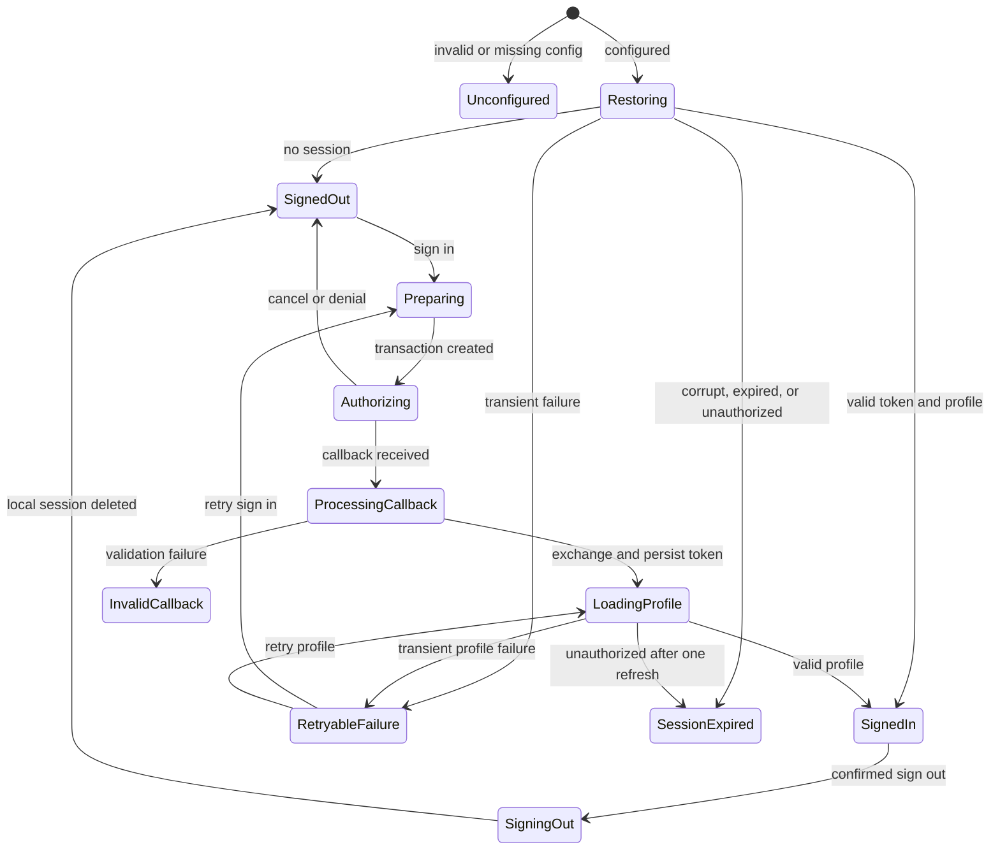
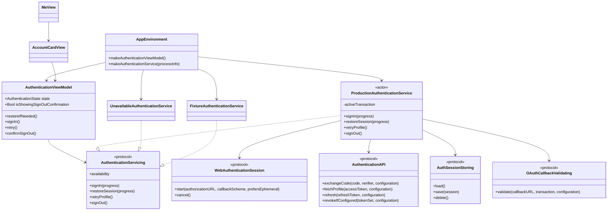
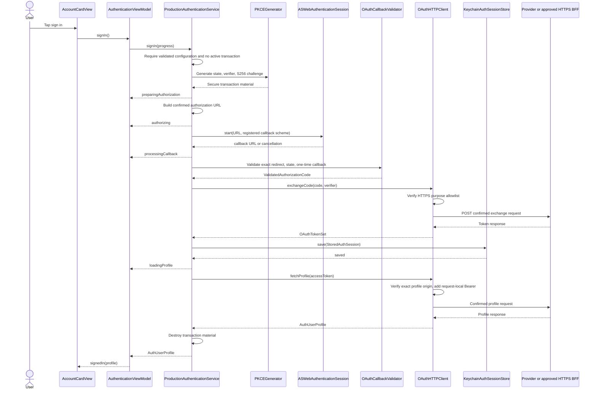
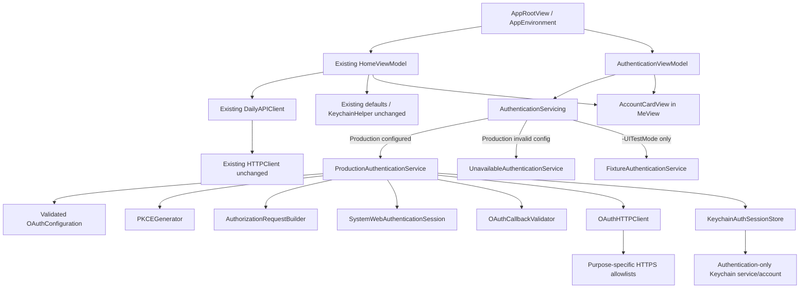

# Zhihu OAuth Incremental Architecture

- Status: implementation-ready architecture; real-provider integration remains blocked by official configuration and contract approval
- Scope: iOS/iPadOS 17+, iPhone and iPad only
- Baseline: `c332e47`
- Input: the complete `docs/features/zhihu-login/product-requirements.md`

## 1. Context and invariants

The current application has a four-tab `TabView`; the account entry belongs only in the “Me” tab (`DailyReader/AppRootView.swift:8`, `DailyReader/AppRootView.swift:31`). `MeView` currently owns the favorites/read switcher, search, and lists (`DailyReader/Features/Me/MeView.swift:44`). Authentication must not gate or mutate those features.

The following constraints are architectural invariants:

1. Use exactly one authorization design: **OAuth 2.0 Authorization Code + PKCE S256 + one-time `state` + `ASWebAuthenticationSession`**.
2. Never use an embedded web view for credentials.
3. If the provider requires a confidential credential during code exchange, the app sends the code and PKCE verifier to an approved HTTPS BFF; that BFF performs the provider exchange. No confidential credential property, build setting, plist key, fixture, log value, or request field exists in the iOS project.
4. Real authentication is unavailable until all required official values are present and validated. Missing configuration produces `.unconfigured`; it must not substitute a website home page, synthesize a URL, or open a web session.
5. Do not modify or wrap the existing public `HTTPClient`. It supports public GETs and arbitrary absolute URLs (`DailyReader/Networking/HTTPClient.swift:30`) and therefore must never receive a global Bearer interceptor.
6. Authentication has its own URLSession client, origin policy, error model, and Keychain store.
7. Tokens are never stored in `UserDefaults`, caches, logs, analytics, screenshots, user-visible messages, or profile models.
8. Authentication state affects only the account card above the existing Me switcher. Favorites, read history, hidden stories, settings, and their existing keys remain unchanged.
9. Do not add macOS or Mac Catalyst. `project.yml` continues to define only iOS application/unit-test/UI-test targets (`project.yml:12`, `project.yml:34`, `project.yml:45`).
10. `project.yml` is the source of Xcode project configuration. Registered callback metadata is added there only after official values are supplied; no fake defaults are committed.

## 2. Single-path technical decision

### 2.1 Authorization path

1. `AuthenticationViewModel.signIn()` rejects the operation unless `AuthenticationConfigurationLoader` returns a fully validated configuration.
2. `PKCEGenerator` creates:
   - `state`: 32 cryptographically secure random bytes, base64url without padding.
   - `codeVerifier`: 64 cryptographically secure random bytes, base64url without padding and within RFC 7636’s 43–128-character limit.
   - `codeChallenge`: base64url(SHA-256(UTF-8(`codeVerifier`))).
3. `AuthorizationRequestBuilder` creates the authorization URL only from the confirmed endpoint and confirmed contract adapter. It includes the authorization-code response type, client identifier, exact redirect URI, approved scopes, `state`, `codeChallenge`, and S256 challenge method.
4. `SystemWebAuthenticationSession` presents `ASWebAuthenticationSession` using an ephemeral browser session where product policy and provider behavior permit it. Its presentation anchor is supplied by the foreground iOS scene.
5. On callback, `OAuthCallbackValidator` validates the exact redirect URI components, one-time transaction identity, and `state` before exposing the authorization code.
6. `OAuthHTTPClient` posts the code, exact redirect URI, and verifier to one configured HTTPS exchange endpoint:
   - direct provider endpoint only if the official public-client contract accepts PKCE without a confidential credential; or
   - approved HTTPS BFF endpoint otherwise.
7. The token set is persisted in the authentication-only Keychain service before the profile request. `OAuthHTTPClient` then requests the profile from its separately configured HTTPS endpoint with a request-local Bearer header.
8. A profile enters `.signedIn` only when it has a non-empty stable subject and display name. An absent or failed avatar becomes a placeholder and does not invalidate login.

There is no implicit fallback between direct exchange and BFF. `exchangeRoute` is a single explicit configuration choice established during integration review.

### 2.2 Configuration gate

`OAuthConfiguration` has no default endpoints. The loader returns one of:

```swift
enum AuthenticationAvailability: Equatable, Sendable {
    case configured
    case unconfigured(UnconfiguredReason)
}

enum UnconfiguredReason: Equatable, Sendable {
    case missingRequiredValues
    case invalidEndpoint
    case invalidRedirect
    case invalidOriginPolicy
    case unsupportedContract
}
```

The production composition root creates `UnavailableAuthenticationService` when loading or validation fails. Calling `signIn()` in that service returns `.configurationUnavailable` without constructing an authorization request or invoking `ASWebAuthenticationSession`. User-facing release text is only “Zhihu login is currently unavailable”; Debug may expose the non-sensitive reason enum.

A valid configuration requires all of the following, sourced from confirmed build/plist values:

```swift
struct OAuthConfiguration: Equatable, Sendable {
    let clientID: String
    let redirectURI: URL
    let authorizationEndpoint: URL
    let exchangeEndpoint: URL
    let profileEndpoint: URL
    let refreshEndpoint: URL?
    let revocationEndpoint: URL?
    let scopes: [String]
    let exchangeRoute: ExchangeRoute
    let allowedAuthorizationOrigins: Set<HTTPSOrigin>
    let allowedAPIOrigins: Set<HTTPSOrigin>
    let allowedAvatarOrigins: Set<HTTPSOrigin>
}

enum ExchangeRoute: String, Sendable {
    case providerPKCE
    case httpsBFF
}

struct HTTPSOrigin: Hashable, Sendable {
    let host: String
    let port: Int?
}
```

`OAuthConfiguration.validate()` requires HTTPS for every network endpoint, a non-empty client identifier and scope list, no endpoint user info or fragment, an exact registered redirect, and endpoint origins present in the appropriate allowlist. Host comparison is lowercased IDNA-normalized exact equality; suffix matching such as `hasSuffix` is forbidden. Default HTTPS port and explicit `443` normalize to the same origin. IP literals are rejected unless explicitly approved in a non-production integration configuration.

The redirect may use only the officially registered callback form. Its scheme, host, path, and port are retained exactly for callback validation. No callback scheme is added to `project.yml` until registration is confirmed.

## 3. Modules and exact file plan

XcodeGen includes the `DailyReader` source directory recursively, so new Swift files require no per-file source entries. The following is the complete implementation file plan.

### 3.1 New application files

| File | Types | Responsibility |
|---|---|---|
| `DailyReader/Authentication/AuthenticationModels.swift` | `AuthenticationState`, `AuthenticationProgress`, `AuthenticationError`, `AuthUserProfile`, `OAuthTokenSet`, `StoredAuthSession`, `AuthorizationTransaction`, `SignOutResult` | Domain values, state, redacted errors; no UI or transport logic. |
| `DailyReader/Authentication/OAuthConfiguration.swift` | `OAuthConfiguration`, `AuthenticationAvailability`, `UnconfiguredReason`, `ExchangeRoute`, `HTTPSOrigin`, `AuthenticationConfigurationLoading` | Load and fail closed on confirmed non-sensitive configuration; enforce endpoint/origin invariants. |
| `DailyReader/Authentication/PKCEGenerator.swift` | `PKCEGenerating`, `SystemPKCEGenerator`, `PKCEPair`, `SecureRandomGenerating` | Generate `state`, verifier, and S256 challenge with Security framework randomness. |
| `DailyReader/Authentication/AuthorizationRequestBuilder.swift` | `AuthorizationRequestBuilding`, `AuthorizationRequestBuilder`, `OAuthContractAdapting` | Encode only contract-confirmed authorization parameters; never invent names or values. |
| `DailyReader/Authentication/OAuthCallbackValidator.swift` | `OAuthCallbackValidating`, `OAuthCallbackValidator`, `ValidatedAuthorizationCode` | Exact redirect and state validation, provider denial mapping, and one-time callback consumption. |
| `DailyReader/Authentication/SystemWebAuthenticationSession.swift` | `WebAuthenticationSession`, `SystemWebAuthenticationSession`, `WebAuthenticationPresentationContext` | Async wrapper around `ASWebAuthenticationSession`, cancellation mapping, strong session retention, and foreground presentation anchor. |
| `DailyReader/Authentication/OAuthHTTPClient.swift` | `AuthenticationAPI`, `OAuthHTTPClient`, `AuthenticationSessionDelegate`, request/response DTOs private to the file | Explicit token/profile/optional refresh/revoke requests over HTTPS with purpose-specific allowlists and redirect rejection. Uses Foundation `URLSession`, not `HTTPClient`. |
| `DailyReader/Authentication/OAuthSessionStore.swift` | `AuthSessionStoring`, `KeychainAuthSessionStore`, `KeychainSecItemClient`, `KeychainStoreError` | Throwing, namespaced, device-local Keychain persistence for the token set only. |
| `DailyReader/Authentication/AuthenticationService.swift` | `AuthenticationServicing`, `ProductionAuthenticationService`, `UnavailableAuthenticationService` | Serialize sign-in, orchestrate callback/exchange/profile, restore, one-shot refresh, retry profile, and local-first sign-out. |
| `DailyReader/Authentication/FixtureAuthenticationService.swift` | `FixtureAuthenticationService`, `AuthMockScenario` | Deterministic UI-test-only service selected exclusively behind `-UITestMode`; performs no web or network call. |
| `DailyReader/Features/Me/AuthenticationViewModel.swift` | `AuthenticationViewModel` | `@MainActor` UI state machine, task ownership, retry intent, notices, and sign-out confirmation state. |
| `DailyReader/Features/Me/AccountCardView.swift` | `AccountCardView`, `ProfileAvatarView` | Paper/ink account UI, adaptive layout, placeholders, progress/error/retry/sign-out controls, and accessibility identifiers. |

### 3.2 Modified application/configuration files

| File | Exact change |
|---|---|
| `DailyReader/AppRootView.swift` | Extend `AppEnvironment` with a process configuration parser and authentication factories; create one `@StateObject` `AuthenticationViewModel`; inject it into `MeView`. Keep all four tabs and public API factories unchanged. |
| `DailyReader/Features/Me/MeView.swift` | Accept the authentication view model; place `AccountCardView` above the existing capsule switcher; constrain the account/switcher/search region to a centered readable column. Preserve the matched-geometry switcher, search semantics, lists, and `HomeViewModel`. |
| `project.yml` | After official callback registration only, add the exact callback URL type and non-sensitive OAuth build/plist mappings under the existing iOS app target. Keep all targets `platform: iOS`; do not add Catalyst/macOS settings. Continue generating the project from this file. |
| `DailyReader/Resources/Info.plist` | Generated/updated through XcodeGen from `project.yml`; contains only approved non-sensitive configuration and registered callback metadata. Do not hand-maintain divergent values. |

`DailyReader/Networking/HTTPClient.swift`, `DailyReader/Networking/ZhihuDailyAPI.swift`, `DailyReader/Storage/KeychainHelper.swift`, and `DailyReader/Features/Home/HomeViewModel.swift` are explicitly **not modified**. The existing Keychain behavior for local reading data remains isolated (`DailyReader/Features/Home/HomeViewModel.swift:40`).

### 3.3 New and modified tests

| File | Action |
|---|---|
| `DailyReaderTests/OAuthConfigurationTests.swift` | New: completeness, HTTPS, exact origins, invalid redirect, and unavailable fail-closed tests. |
| `DailyReaderTests/PKCEGeneratorTests.swift` | New: entropy-source use, verifier bounds/alphabet, deterministic S256 vector, and uniqueness. |
| `DailyReaderTests/OAuthCallbackValidatorTests.swift` | New: exact callback, state, denial, missing/duplicate parameters, and one-time consumption. |
| `DailyReaderTests/OAuthHTTPClientTests.swift` | New: method/body/header contract, purpose allowlists, redirect rejection, decoding, status mapping, redaction, profile 401, refresh, revoke. |
| `DailyReaderTests/OAuthSessionStoreTests.swift` | New: service/account/accessibility query, throwing statuses, corrupt data deletion, and isolation from existing keys. |
| `DailyReaderTests/AuthenticationServiceTests.swift` | New: complete orchestration, transaction serialization, persistence timing, restore/refresh/profile retry, invalidation, and local-first sign-out. |
| `DailyReaderTests/AuthenticationViewModelTests.swift` | New: every UI state transition, retry intent, task cancellation, and non-blocking restore. |
| `DailyReaderTests/AuthenticationTestDoubles.swift` | New: in-memory store, deterministic random source, API/web/session/config spies; no real endpoint or credential. |
| `DailyReaderUITests/AuthenticationFlowUITests.swift` | New: deterministic account-card scenarios and accessibility assertions. |
| `DailyReaderUITests/MeFlowUITests.swift` | Modify the obsolete “no login/avatar” assertion (`DailyReaderUITests/MeFlowUITests.swift:54`) to assert the configured mock account state while retaining capsule/search coverage. |
| `DailyReaderUITests/KeychainFlowUITests.swift` | Add assertions that authentication reset/sign-out does not remove favorites/read data; retain existing local-data recovery contract. |
| `DailyReaderTests/MockURLProtocol.swift` | Modify only if needed to capture response headers/redirect attempts for `OAuthHTTPClient`; keep public API tests unchanged. |

## 4. Core protocols and responsibilities

```swift
protocol AuthenticationServicing: Sendable {
    var availability: AuthenticationAvailability { get }

    func signIn(
        progress: @escaping @MainActor @Sendable (AuthenticationProgress) -> Void
    ) async throws -> AuthUserProfile

    func restoreSession(
        progress: @escaping @MainActor @Sendable (AuthenticationProgress) -> Void
    ) async throws -> AuthUserProfile?

    func retryProfile() async throws -> AuthUserProfile
    func signOut() async -> SignOutResult
}

protocol WebAuthenticationSession: Sendable {
    func start(
        authorizationURL: URL,
        callbackScheme: String,
        prefersEphemeral: Bool
    ) async throws -> URL
    func cancel() async
}

protocol AuthenticationAPI: Sendable {
    func exchangeCode(
        _ code: ValidatedAuthorizationCode,
        verifier: String,
        configuration: OAuthConfiguration
    ) async throws -> OAuthTokenSet

    func fetchProfile(
        accessToken: String,
        configuration: OAuthConfiguration
    ) async throws -> AuthUserProfile

    func refresh(
        refreshToken: String,
        configuration: OAuthConfiguration
    ) async throws -> OAuthTokenSet

    func revokeIfConfigured(
        tokenSet: OAuthTokenSet,
        configuration: OAuthConfiguration
    ) async throws
}

protocol AuthSessionStoring: Sendable {
    func load() async throws -> StoredAuthSession?
    func save(_ session: StoredAuthSession) async throws
    func delete() async throws
}

protocol OAuthCallbackValidating: Sendable {
    func validate(
        callbackURL: URL,
        transaction: AuthorizationTransaction,
        configuration: OAuthConfiguration
    ) throws -> ValidatedAuthorizationCode
}
```

`ProductionAuthenticationService` is an `actor`. It owns at most one `AuthorizationTransaction`, rejects a second sign-in as `.operationAlreadyInProgress`, and clears the transaction with `defer` on success, cancellation, denial, callback failure, transport failure, and task cancellation. The UI layer never reads a verifier, code, callback URL, or token.

`AuthenticationViewModel` is `@MainActor`; it owns one operation `Task`, ignores stale completions via an operation UUID, and exposes only redacted display state. `deinit`/explicit cancellation cancels the task and asks the web-session abstraction to cancel an active session.

## 5. Data structures

```swift
struct PKCEPair: Equatable, Sendable {
    let verifier: String
    let challenge: String
}

struct AuthorizationTransaction: Sendable {
    let id: UUID
    let state: String
    let verifier: String
    let createdAt: Date
    var callbackConsumed: Bool
}

struct ValidatedAuthorizationCode: Sendable {
    let value: String
}

struct OAuthTokenSet: Codable, Equatable, Sendable {
    let accessToken: String
    let refreshToken: String?
    let tokenType: String
    let expiresAt: Date?
    let grantedScopes: [String]
}

struct StoredAuthSession: Codable, Equatable, Sendable {
    let schemaVersion: Int
    let tokenSet: OAuthTokenSet
}

struct AuthUserProfile: Equatable, Sendable {
    let subject: String
    let displayName: String
    let avatarURL: URL?
}

enum RetryIntent: Equatable, Sendable {
    case signIn
    case restore
    case profile
}

struct AuthenticationFailure: Equatable, Sendable {
    let message: String
    let retryIntent: RetryIntent?
    let correlationID: String?
}
```

The token response adapter validates a non-empty access token and an accepted token type before constructing `OAuthTokenSet`. If expiry is returned as a duration, it is converted once to absolute `expiresAt` using an injected clock. Refresh tokens are optional and used only when the confirmed contract enables refresh.

The profile response adapter trims fields and requires non-empty `subject` and `displayName`. `avatarURL` must be HTTPS and match `allowedAvatarOrigins`; otherwise it becomes `nil`. Profile data is held in memory and re-fetched on restore. It is not embedded in the Keychain token blob or copied into `UserDefaults`.

## 6. State machine

```swift
enum AuthenticationState: Equatable {
    case unconfigured
    case signedOut(notice: String?)
    case preparingAuthorization
    case authorizing
    case processingCallback
    case loadingProfile
    case restoring
    case retryableFailure(AuthenticationFailure)
    case invalidCallback(message: String)
    case sessionExpired(message: String)
    case signedIn(AuthUserProfile)
    case signingOut(AuthUserProfile)
}
```

Sign-out confirmation is a separate Boolean presentation property because it does not destroy the underlying `.signedIn(profile)` state until the user confirms.

| Current state | Event | Guard/action | Next state |
|---|---|---|---|
| initial | app composition | invalid/missing configuration | `.unconfigured` |
| initial | app composition | configured | `.restoring`, launch child task without blocking tabs |
| `.restoring` | no stored session | — | `.signedOut(nil)` |
| `.restoring` | valid session/profile | — | `.signedIn(profile)` |
| `.restoring` | transient profile/network error | retain valid stored token | `.retryableFailure(.restore/.profile)` |
| `.restoring` | corrupt/expired/unauthorized and no successful refresh | delete auth entry only | `.sessionExpired(...)` |
| `.signedOut` / retryable sign-in failure | login | configured and no operation | `.preparingAuthorization` |
| `.preparingAuthorization` | request built | transaction retained | `.authorizing` |
| `.authorizing` | user cancels | clear transaction; neutral notice | `.signedOut("Login canceled")` |
| `.authorizing` | provider denial | clear transaction | `.signedOut("Authorization was not granted")` |
| `.authorizing` | callback | consume once, exact validation | `.processingCallback` |
| `.processingCallback` | invalid callback | no exchange; clear transaction | `.invalidCallback(...)` |
| `.processingCallback` | token stored | — | `.loadingProfile` |
| `.loadingProfile` | valid profile | — | `.signedIn(profile)` |
| `.loadingProfile` | transient profile failure | keep token for profile retry | `.retryableFailure(.profile)` |
| `.loadingProfile` | unauthorized; refresh succeeds once | replace stored token, retry profile once | `.signedIn` or terminal mapping |
| `.signedIn` | auth API returns invalid session | one refresh attempt if confirmed | `.signedIn` or `.sessionExpired` |
| `.signedIn` | tap sign out | present confirmation only | `.signedIn` |
| `.signedIn` | confirm sign out | immediately delete local auth session | `.signingOut(profile)` |
| `.signingOut` | local deletion finishes | clear profile and transaction; remote revoke is best effort | `.signedOut("Signed out on this device")` |



## 7. Callback and transaction security

Validation order is fixed and fail-closed:

1. Require one active, non-expired transaction (recommended lifetime: five minutes, represented by an injected policy/clock).
2. Atomically mark its callback as consumed before asynchronous exchange work. Any second callback returns `.callbackAlreadyConsumed`.
3. Compare callback scheme, normalized host, effective port, and standardized path to the registered redirect. Reject user info, fragment, unexpected path, and origin changes. Do not accept prefix matching.
4. Parse query items without logging the URL. Reject duplicate security-sensitive keys, malformed percent encoding, and a simultaneous success code plus provider error.
5. Compare the returned `state` to the transaction value using constant-time byte comparison. Missing or mismatched state terminates the transaction.
6. Map a confirmed provider denial to `.authorizationDenied`; do not classify it as password/account failure.
7. Require exactly one non-empty authorization code. Wrap it in `ValidatedAuthorizationCode`; the raw value never enters UI state or error text.
8. Clear state/verifier immediately after exchange finishes or any terminal failure. A callback delivered after process termination has no matching in-memory transaction and is rejected; the app never weakens state validation to recover it.

`ASWebAuthenticationSession` cancellation error maps to a neutral canceled result. Other presentation errors become retryable only after redaction. Fast repeated taps cannot create parallel sessions.

## 8. Token and profile networking

`OAuthHTTPClient` uses a dedicated ephemeral `URLSessionConfiguration` with request/resource timeouts and no URL cache or credential storage. It does not use Alamofire’s current interceptor and does not share cookies or global headers with public APIs.

For every request:

1. Select the exact endpoint from validated `OAuthConfiguration`; callers cannot provide arbitrary URLs.
2. Require HTTPS and exact purpose allowlist membership immediately before request creation.
3. Encode using the confirmed contract adapter. No guessed endpoint, method, field name, scope, or response shape is implemented.
4. Set `Accept: application/json`. Set the confirmed request content type. Place authorization code and verifier in the POST body, never in query parameters or logs.
5. Add Bearer authorization only inside `fetchProfile` (and a confirmed revoke contract if required) and only after the endpoint passes the profile/API origin check.
6. Use `AuthenticationSessionDelegate` to reject HTTP redirects by returning `nil`; the app does not forward a code, verifier, or Bearer value to a redirect target. A future approved same-origin redirect requires an explicit architecture/configuration change and tests.
7. Accept only 2xx responses with the expected MIME/body contract and bounded response size. Map 401/403 to authentication invalidation where appropriate, 429/5xx/timeouts to retryable errors, and malformed responses to safe contract errors.
8. Extract an optional non-sensitive correlation ID only from an approved response header/body field. Never surface raw response bodies, request URLs, codes, or tokens.

Direct and BFF exchanges share this client boundary. In BFF mode the configured exchange endpoint must be an approved BFF HTTPS origin. BFF authentication, replay prevention, rate limiting, monitoring, and log redaction are prerequisites owned by the backend contract; the iOS app still sends PKCE verifier and exact redirect data and never bypasses callback validation.

## 9. Keychain isolation

Do not extend `KeychainHelper`: it keys only by account and discards Security status values (`DailyReader/Storage/KeychainHelper.swift:10`, `DailyReader/Storage/KeychainHelper.swift:29`). Authentication uses a new throwing actor-backed store with this exact namespace:

- `kSecClass`: `kSecClassGenericPassword`
- `kSecAttrService`: `com.codex.DailyReader.auth.zhihu.oauth.v1`
- `kSecAttrAccount`: `session.current`
- `kSecAttrAccessible`: `kSecAttrAccessibleAfterFirstUnlockThisDeviceOnly`
- `kSecAttrSynchronizable`: `false`
- value: versioned JSON encoding of `StoredAuthSession`

Every read/update/delete query contains both service and account. Save performs update-or-add and checks all `OSStatus` values. Read distinguishes item-not-found from Security errors. Decode/schema corruption triggers deletion of only this exact authentication item and reports a recoverable secure-storage failure. Sign-out uses the same exact query and never performs service-wide or class-wide deletion.

Isolation tests assert that auth deletion cannot match existing accounts such as `DailyReader.readStoryIDs`, `DailyReader.hiddenStories`, `DailyReader.favoriteStories`, or `DailyReader.readStories`. Authentication tests use an injected in-memory store by default; Security query tests use a capturing `KeychainSecItemClient` and a dedicated test service suffix so they cannot alter user data.

## 10. Restore, refresh, invalidation, and sign-out

### Restore

- `AppRootView` creates `AuthenticationViewModel` independently from `HomeViewModel` and calls `restoreIfNeeded()` in a child `.task` attached to the account card/root.
- Restore begins asynchronously and never blocks construction, selection, loading, or navigation of the other tabs.
- No stored session means signed out without an error.
- A token with a known future expiry fetches profile directly.
- A token known to be expired uses refresh only when the confirmed configuration includes a refresh endpoint and a refresh token exists.
- A token without known expiry is validated by profile fetch. A 401/403 follows the one-shot refresh policy; transient transport failure keeps the stored token and offers profile/restore retry.

### Refresh

- Refresh is optional and disabled unless officially confirmed.
- Refresh is single-flight inside `ProductionAuthenticationService`.
- At most one refresh and one replay of the failed profile request occur per operation. There is no retry loop.
- On success, atomically replace the stored token set before retrying profile.
- Missing refresh capability, invalid refresh response, or refresh 401/403 deletes the auth entry and becomes `.sessionExpired`.
- Transient refresh transport/5xx failure does not falsely claim signed-in status; it exposes retry without leaking details. If the access token is already invalid/expired, UI requires re-authentication after retry policy is exhausted.

### Sign-out

1. User confirmation text explicitly states favorites and read history remain.
2. Cancel any active authentication/profile/refresh task and destroy in-memory transaction/profile.
3. Delete the local auth Keychain item and update UI locally; this is the security-critical completion condition.
4. If an official revocation endpoint exists, make one best-effort redacted request. Remote failure does not restore local tokens and yields “Signed out on this device.”
5. Never touch public API cache, `UserDefaults`, existing local Keychain accounts, favorites, read history, hidden stories, or settings.

## 11. AppEnvironment and dependency injection

`AppEnvironment` remains the composition root, but authentication construction is separated from the existing public API factory (`DailyReader/AppRootView.swift:57`). Recommended signatures:

```swift
enum AppEnvironment {
    @MainActor
    static func makeAuthenticationViewModel() -> AuthenticationViewModel

    static func makeAuthenticationService(
        processInfo: ProcessInfo = .processInfo
    ) -> any AuthenticationServicing
}
```

Composition rules:

1. Parse launch mode once into an immutable `AppLaunchConfiguration`.
2. If and only if arguments contain `-UITestMode`, build `FixtureAuthenticationService` from the test scenario and an isolated in-memory session store. Do not create `ASWebAuthenticationSession` or `OAuthHTTPClient` in this branch.
3. In ordinary runs, ignore all authentication mock environment variables.
4. Load and validate production configuration. If invalid/missing, inject `UnavailableAuthenticationService`.
5. If valid, compose `SystemPKCEGenerator`, request builder, callback validator, system web session, dedicated auth API, dedicated Keychain store, and `ProductionAuthenticationService`.
6. `AppRootView` owns both view models for app lifetime and injects them into `MeView`; authentication never becomes a dependency of Home, Hot List, Detail, or Settings.

## 12. UI-test launch contract

Existing tests already use `-UITestMode` plus `MOCK_SCENARIO` for public content (`DailyReader/AppRootView.swift:79`, `DailyReader/AppRootView.swift:92`). Preserve that contract and add namespaced authentication inputs:

| Input | Type | Meaning |
|---|---|---|
| `-UITestMode` | launch argument | Mandatory gate enabling any fixture authentication behavior. |
| `-ResetAuthSession` | launch argument | Clears only the fixture authentication store before startup. Ignored outside UI-test mode. |
| `MOCK_SCENARIO` | environment | Existing daily/hot-list fixture scenario; unchanged. |
| `MOCK_AUTH_SCENARIO` | environment | Authentication scenario listed below. Read only when `-UITestMode` is present. |

Allowed `MOCK_AUTH_SCENARIO` values:

- `unconfigured`
- `signed_out`
- `sign_in_success`
- `user_cancelled`
- `authorization_denied`
- `invalid_callback`
- `network_failure_then_success`
- `service_failure_then_success`
- `restored_signed_in`
- `session_expired`
- `profile_failure_then_success`
- `avatar_failure`
- `sign_out_remote_failure`

Unknown values fail closed to `unconfigured`, not a success scenario. Scenarios express outcomes only; none contains an endpoint, authorization code, token, or confidential value. The fixture uses a fixed synthetic profile such as `subject = "ui-test-user"`, `displayName = "Test Reader"`, and either an app-bundled non-sensitive image or `nil`. It never opens a system sheet or accesses the network.

`-ResetAuthSession` is independent of `-ResetCache`, `-ResetUserDefaults`, and `MOCK_KEYCHAIN_STATUS`. This preserves the ability to prove that auth sign-out/reset does not delete local reading data.

## 13. Me UI and iPhone/iPad adaptation

`MeView` changes only its top region:

```text
Navigation title “Me”
└─ centered readable column (horizontal 16 pt; max width 720 pt)
   ├─ AccountCardView
   ├─ existing favorites/read capsule
   └─ existing search field
└─ existing favorites or read list
```

- Use `DS.paper`, `DS.paperElevated`, `DS.ink`, `DS.inkSecondary`, `DS.indigo`, and the existing 0.7 pt hairline. Structural title/display name uses Song type; status/error/body uses system fonts.
- The card uses `ViewThatFits(in: .horizontal)` or an equivalent size-class/Dynamic-Type-aware choice: horizontal avatar/name/action at regular widths, vertical arrangement at narrow widths or accessibility text sizes.
- Interactive targets have a minimum 44×44 pt frame. Text wraps; the primary operation is never truncated.
- On iPhone, keep 16 pt page margins and preserve the Me navigation/scroll location around system authorization.
- On iPad full screen, landscape, Split View, and Slide Over, center the top controls at maximum 720 pt. Lists may retain current full-page behavior but their row content must remain readable and non-overlapping.
- Do not introduce NavigationSplitView, a desktop popover, macOS target, or Catalyst target for this increment.
- Respect dark mode through existing dynamic colors and Reduce Motion by avoiding required decorative transitions.

Stable accessibility identifiers:

- `auth.card`
- `auth.status`
- `auth.signInButton`
- `auth.retryButton`
- `auth.avatar`
- `auth.displayName`
- `auth.signOutButton`
- `auth.signOut.confirm`
- `auth.signOut.cancel`
- `auth.error`

VoiceOver order within the card is title → status or display name → explanation/error → primary action. State is always textual, not color-only. A decorative placeholder avatar is hidden; an identity-bearing avatar label is “Avatar for {displayName}” and never reads its URL.

## 14. Error taxonomy and redaction

`AuthenticationError` separates behavior from display text:

- configuration unavailable: non-retryable in release UI
- operation already active: ignored/disabled UI
- user canceled: neutral signed-out notice
- authorization denied: explanatory signed-out notice
- invalid redirect / missing state / state mismatch / duplicate parameter / callback consumed / missing code: invalid callback, restart required
- network timeout/offline/429/5xx: retryable
- response contract/profile required field failure: retryable only where the contract permits; otherwise integration error
- 401/403 or confirmed invalid token: one refresh attempt, then session expired
- Keychain read/write/delete failure: safe storage error; never claim persistence succeeded
- corrupt stored session: delete auth item only and fall back safely
- avatar invalid/load failure: signed in with placeholder

All errors expose a localized category message and optional approved correlation ID. `CustomStringConvertible`, logs, assertions, and analytics use only category codes. Raw underlying descriptions are not sent to user-visible state because they may contain request URLs. Use privacy-sensitive OS logging and never interpolate callbacks, request bodies, authorization headers, codes, verifiers, states, or token values.

## 15. Unit test matrix

| Area | Required cases | Principal assertions |
|---|---|---|
| Configuration | missing each required value; malformed URL; HTTP endpoint; user info/fragment; endpoint not in allowlist; unknown route; valid direct/BFF route | invalid configuration returns unavailable; no URL/session/network construction |
| PKCE/state | deterministic RFC S256 vector; verifier length/alphabet; state length; 1,000 generated values; random-source failure | S256 correctness, uniqueness, failure propagation, no weak fallback |
| Authorization builder | all confirmed parameters; percent encoding; duplicate prevention | exact request only; no invented defaults; code challenge method S256 |
| Callback | exact success; missing code/state; mismatched state; wrong scheme/host/port/path; duplicate code/state; code+error; denial; expired transaction; second callback | invalid callbacks never call exchange; state comparison and one-time consumption |
| Web session | success; cancel; presentation failure; task cancellation; retained session | correct callback scheme; neutral cancellation; no duplicate completion |
| Exchange client | direct and BFF configured routes; non-HTTPS; wrong origin; redirect; 2xx; 4xx; 429; 5xx; timeout; malformed/oversized body | exact method/body/content type; no arbitrary URL; redirect denied; redacted errors |
| Profile client | valid subject/name/avatar; missing required field; no avatar; avatar wrong origin; 401; timeout | Bearer only on exact profile request; placeholder does not log out |
| Refresh/revoke | disabled; valid one-shot refresh; missing refresh token; refresh 401; transient failure; revoke success/failure | no loops; token replacement ordering; local sign-out remains final |
| Keychain | add/update/read/delete; not found; each Security error; corrupt/schema data; accessibility; synchronizable false; service/account capture | throwing behavior and exact authentication namespace; no existing key match |
| Service sign-in | success; cancel; denial; invalid callback; network failure; profile failure; save failure; rapid double tap; stale completion | legal progress order; single active transaction; cleanup on every path |
| Restore | no session; valid; expired; unknown expiry; profile transient failure; unauthorized; refresh success/failure; corrupt Keychain | non-blocking caller; preserve valid token on transient profile failure; clear only invalid auth item |
| View model | all states; retry sign-in/profile/restore; confirmation cancel/confirm; task cancellation | main-actor state, correct retry intent, no token/code/profile URL leakage |
| Isolation regression | auth reset/sign-out with populated favorites/read/hidden/settings | all local business data remains byte-for-byte unchanged |

Tests inject a clock, randomness, web session, API, store, and configuration. No unit test requires network access, a real account, or real platform values.

## 16. UI test matrix

Run the authentication suite and existing Me regressions on representative iPhone and iPad simulators.

| Scenario | Steps | Assertions |
|---|---|---|
| Unconfigured | launch `unconfigured`, open Me | disabled unavailable button/message; no system web sheet; favorites/read controls work |
| Signed out | launch `signed_out` | purpose copy and sign-in button; account card precedes switcher |
| Success | tap sign in under `sign_in_success` | progress text then synthetic name/avatar or placeholder; no real browser/network |
| Cancel | tap sign in under `user_cancelled` | neutral canceled notice; signed-out card; local list unchanged |
| Denial | `authorization_denied` | “not authorized” result; retry available; no password implication |
| Invalid callback | `invalid_callback` | security error and fresh-login action; no signed-in profile |
| Network/service retry | respective `*_then_success` | in-card error; retry succeeds exactly once |
| Restore | `restored_signed_in` without tapping Me first | other tabs immediately usable; Me shows restore state then signed-in profile |
| Session expired | `session_expired` | expired message and re-login; favorites/read retained |
| Profile retry | `profile_failure_then_success` | token-backed profile retry reaches signed in without system authorization |
| Avatar failure | `avatar_failure` | name displayed; stable placeholder; signed-in controls remain |
| Sign-out confirmation | signed in, tap sign out, cancel; repeat and confirm | cancellation preserves profile; confirmation clears only auth UI/session |
| Remote sign-out failure | `sign_out_remote_failure` | local signed-out state remains; “on this device” notice |
| Accessibility/Dynamic Type | largest accessibility size, light/dark, Reduce Motion | identifiers available, wrapping/no overlap, actions ≥44 pt, textual state |
| iPad adaptation | portrait, landscape, Split View widths | centered ≤720 pt top column; no clipping/overlap; system presentation behavior |
| Me regression | favorite/read switch and search before/after login/logout | existing matched switcher, search text, lists, and local data behavior unchanged |

UI tests query identifiers and labels, never coordinates or colors. The obsolete assertion that Me has no login button is replaced with explicit account-state assertions.

## 17. Class diagram



## 18. Sign-in sequence



## 19. Dependency graph



The graph intentionally has no edge from authentication to existing `HTTPClient`, existing `KeychainHelper`, or the public Home/Hot/Detail clients.

## 20. Implementation order and dependencies

Engineers should implement in this order; each item’s dependencies are explicit.

1. **Confirm external contract and registered callback** — obtain approved client identifier, exact authorization/exchange/profile endpoints and methods, scopes, redirect, response/error schemas, origin allowlists, refresh/revoke support, and direct-vs-BFF exchange decision. **Depends on:** product/platform/backend owners. **Blocks:** production configuration and real integration; Mock work may proceed.
2. **Add domain models and error redaction** — implement `AuthenticationModels.swift` with no transport/UI dependencies. **Depends on:** none.
3. **Implement configuration gate and origin policy** — implement `OAuthConfiguration.swift`; add no fake defaults. **Depends on:** 2. Production values from item 1 may be absent, in which case only unavailable mode is valid.
4. **Implement PKCE/state generation** — Security randomness, base64url, S256, injected clock/random source. **Depends on:** 2.
5. **Implement authorization builder and callback validator** — contract adapter, exact redirect checks, constant-time state comparison, atomic one-time consumption. **Depends on:** 2–4 and confirmed parameter contract for the production adapter.
6. **Implement system web-session adapter** — async `ASWebAuthenticationSession`, foreground presentation anchor, cancellation, retention. **Depends on:** 2. Registered callback from item 1 is required only for real launch.
7. **Implement isolated Keychain store** — exact service/account namespace, throwing status handling, versioned data. **Depends on:** 2.
8. **Implement dedicated OAuth HTTP client** — explicit endpoint requests, purpose allowlists, redirect denial, token/profile adapters, optional refresh/revoke. Do not touch public `HTTPClient`. **Depends on:** 2–3 and confirmed contracts from item 1.
9. **Implement production/unavailable authentication services** — actor serialization, sign-in orchestration, persistence ordering, restore, one-shot refresh, profile retry, local-first sign-out. **Depends on:** 3–8.
10. **Implement fixture service and launch parser** — deterministic `AuthMockScenario`, in-memory store, strict `-UITestMode` gate. **Depends on:** 2 and service protocol from 9; does not depend on real configuration.
11. **Wire AppEnvironment and app lifetime ownership** — create auth view model once, select production/unavailable/fixture service, inject into Me. Keep current public API factory behavior. **Depends on:** 9–10.
12. **Implement AuthenticationViewModel state machine** — operation UUID, progress mapping, retry intent, cancellation, sign-out confirmation. **Depends on:** 2 and 9.
13. **Implement account card and adaptive Me layout** — account card above existing controls, 720 pt top-column cap, Dynamic Type/accessibility identifiers, placeholders. Preserve existing switcher/search/list logic. **Depends on:** 12.
14. **Add XcodeGen callback/configuration entries only when official values exist** — edit `project.yml`, regenerate the Xcode project/Info metadata, retain iOS-only targets. If item 1 remains blocked, skip this item and ship unavailable + Mock behavior only. **Depends on:** 1 and 3.
15. **Add unit tests in dependency order** — configuration/PKCE/callback → Keychain/HTTP → service/view model → isolation regressions. **Depends on:** corresponding items 3–12.
16. **Add UI tests and update Me regressions** — all mock scenarios, restore/sign-out/isolation, iPhone/iPad/Dynamic Type; replace obsolete no-login assertion. **Depends on:** 10–13.
17. **Run generation, build, and test gates** — XcodeGen generation when project config changed; build app; run `DailyReaderTests` and `DailyReaderUITests` on representative iPhone and iPad simulators; verify no real auth traffic in tests. **Depends on:** 14–16.
18. **Perform real-device integration review** — only after item 1 is complete: callback, cancel/deny, weak network, expiration, refresh/revoke, BFF controls if applicable, and log/privacy audit. **Depends on:** 1, 14, 17.

Parallelization after item 2: items 3, 4, 6, and 7 can proceed concurrently; UI fixture work can proceed without item 1. Items 8–9 and real configuration remain blocked by the confirmed external contract.

## 21. Definition of done

- Authorization uses Authorization Code, PKCE S256, one-time state, and `ASWebAuthenticationSession` only.
- Invalid/missing production configuration cannot construct or open any endpoint.
- If confidential exchange is required, only the approved HTTPS BFF path is configured; the iOS project contains no confidential credential property or field.
- Callback origin/state/one-time checks occur before exchange.
- Bearer authorization is request-local and can reach only the configured profile/API origin.
- Authentication tokens exist only in the isolated Keychain item; corrupt/auth-invalid data removal cannot match local reading-data keys.
- Restore is asynchronous and other tabs remain usable; refresh is confirmed-contract-only and one-shot.
- Local sign-out always wins and retains favorites/read/hidden/settings data.
- UI tests are deterministic under the launch contract and never launch a real authorization page.
- iPhone and iPad layouts, accessibility, dark/light mode, and existing Me interactions pass.
- Existing public `HTTPClient` is unchanged.
- No macOS or Catalyst target is added.
